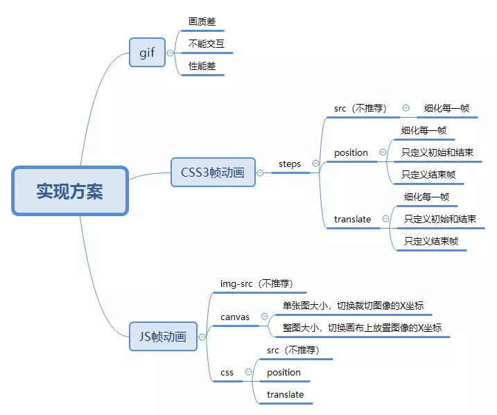
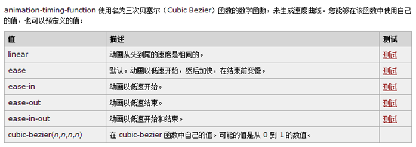
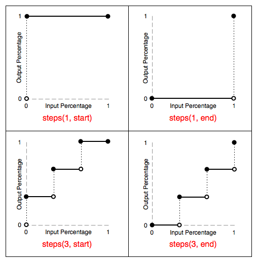

# 逐帧动画

我们一般用帧动画来做页面的Loading，小人物，小物体元素的简单动画


### 素材准备


设计师利用PS或AE等工具制作时间轴的动画，导出图片给到前端。帧动画素材的要求，每一帧的图片最好是偶数宽高，偶数张，最好周围能有一些留白。


前端拿到素材 制作成雪碧图 可以是x轴或者y轴上的雪碧图


### 动画需要满足的要求


1. 可以自由控制播放、暂停和停止
2. 可以控制播放次数，播放速度
3. 可以添加交互，在播放完成后添加事件
4. 浏览器兼容性好


### 实现方案





+ gif
+ JavaScript
+ CSS3 Animation
+ video 视频可以实现所有类型的动画


<font style="color:#1A1A1A;">实现逐帧动画需要两个条件：（1）动画帧；（2）连续播放。</font>JS 与 CSS3，一般是将动画帧放到背景图中。不同的是， JS 是使用脚本来控制动画的连续播放的：CSS3是通过animation timing function控制的


### 0 GIF 动画


优点：

成本低，


缺点：


1. 画质上，gif 支持颜色少(最大256色)、Alpha 透明度支持差，图像锯齿毛边比较严重；
2. 交互上，不能直接控制播放、暂停、播放次数，灵活性差；
3. 性能上，gif 会引起页面周期性的**绘画**，性能较差


### 1 JS 帧动画


将动画帧放到背景图中，使用脚本来控制动画的连续播放的：


+ **通过JS来控制img的src属性切换（不推荐）**
+ **通过JS来控制Canvas图像绘制**
+ **通过JS来控制CSS属性值变化 **


<font style="color:#DF2A3F;">JS 改变背景图位置 示例代码</font>


```javascript
.sprite {
    width: 300px;
    height: 300px;
    background: url(frame.png) no-repeat 0 0;
}

<div class="sprite" id="sprite"></div>

(function(){
    var sprite = document.getElementById("sprite"),
	    picWidth = 300,
	    k = 20,
	    i = 0,
	    timer = null;
    // 重置背景图片位置
    sprite.style = "background-position: 0 0";
    // 改变背景图位置
    function changePosition(){
        sprite.style = "background-position: "+(-picWidth*i)+"px 0";
        i++;
        if(i == k){
            i = 0;
        }
        window.requestAnimationFrame(changePosition);
    }
    window.requestAnimationFrame(changePosition);
})();

```


### 2 CSS 帧动画 


又称精灵动画


CSS3 实际上是使用 animation-timing-function 的阶梯函数 steps(number_of_steps, direction) 来实现逐帧动画的连续播放的。


将所有的动画帧合并成一张雪碧图（sprite），通过改变 background-position 的值来实现动画帧切换。因此，逐帧动画也被称为“精灵动画（sprite animation）”。


> 说明： 使用keyframes定义一组动画，通过animiation引用，简洁高效，动画流畅。前提是需要先拼合图片，另一方面讲也减少了请求数。适用于帧数不多的动画效果。
>


**animation-timing-function 规定动画的速度曲线 **


> CSS animation-timing-function属性定义CSS动画在每一动画周期中执行的节奏。对于关键帧动画来说，timing function作用于一个关键帧周期而非整个动画周期，即从关键帧开始开始，到关键帧结束结束。
>


**animation-timing-function 预定义的值**


    


#### 一、连续切换动画图片地址src（不推荐）


缺点：

1. 多张图片会带来多个 HTTP 请求
2. 每张图片首次加载会造成图片切换时的闪烁
3. 不利于文件的管理


#### 二、连续切换雪碧图位置（推荐）


可以有2个方式


+ 定义整个动画周期
+ 只定义初始和结束帧


steps 指定了一个阶梯函数，包含两个参数：

第一个参数指定了函数中的间隔数量（必须是正整数）；

第二个参数可选，指定在每个间隔的起点或是终点发生阶跃变化，接受 start 和 end 两个值，默认为 end。





快捷值

step-start等同于steps(1,start)，动画分成1步，动画执行时为开始左侧端点的部分为开始；

step-end等同于steps(1,end)：动画分成1步，动画执行时以结尾端点为开始，默认值为end。


#### 三、连续移动雪碧图位置（移动端推荐）


切换雪碧图的位置过程换成了transform:translate3d()来实现，使用transform可以开启GPU加速，提高机器渲染效果，还能有效解决移动端帧动画抖动的问题。


### 结论和注意事项


实现帧动画的方案多种多样，综合看来，css transform:translate3d() 方案各项指标较好。


**移动端适配最好不用rem，因为rem的计算会造成小数四舍五入，造成一定的动画抖动效果**


> 非逐帧动画部分，使用 rem 做单位；
>
> 逐帧动画部分，使用 px 做单位，再结合 js 对动画部分使用 scale 进行缩放。【或辅助以scale（zoom）媒体查询进行适配】
>


计算帧数的工具：[CSS3动画帧数计算器](http://tid.tenpay.com/labs/css3_keyframes_calculator.html)


### 参考


[深入理解CSS3 Animation 帧动画](http://www.cnblogs.com/aaronjs/p/4642015.html)

<font style="color:#096DD9;">帧动画的多种实现方式与性能对比</font>

[CSS技巧：逐帧动画抖动解决方案](https://aotu.io/notes/2017/08/14/fix-sprite-anim/index.html)

指尖上行

[step实现倒计时](https://juejin.im/post/5cf3dfc0f265da1b9612ed07#heading-8)

[关于移动端适配，你必须要知道的](https://juejin.im/post/5cddf289f265da038f77696c)


> 更新: 2023-07-21 15:05:37  
> 原文: <https://www.yuque.com/u3641/dxlfpu/ob43sh>