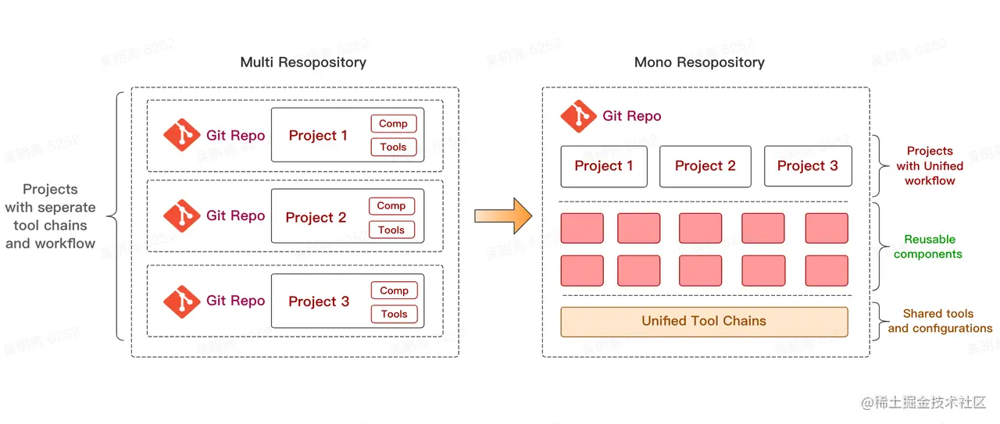

# pnpm

<font style="color:#DF2A3F;">Fast, disk space efficient package manager</font>


# MultiRepo -> pnpm monorepo 实践
pnpm has built-in support for multiple packages in a repository





一个 workspace 的根目录下必须有 pnpm-workspace.yaml 文件， 也可能会有 .npmrc 文件。

```javascript
packages:
    - 'sdk/**'
    - 'apps/**'
    - 'dapps/**'
    - '!**/dist/**'
    - '!sdk/typescript/builder'
    - '!sdk/typescript/faucet'
    - '!sdk/typescript/*/**'

```


 

filter

```javascript
  "core": "pnpm --filter ./apps/core",
  "icons": "pnpm --filter ./apps/icons",
  "explorer": "pnpm --filter ./apps/explorer",
  "wallet": "pnpm --filter ./apps/wallet",
  "wallet-adapter": "pnpm --filter ./sdk/wallet-adapter",
  "wallet-kit-site": "pnpm --filter wallet-kit-site",
  "sdk": "pnpm --filter ./sdk/typescript",
  "bcs": "pnpm --filter ./sdk/bcs",
  "kiosk": "pnpm --filter ./sdk/kiosk",
  "suins": "pnpm --filter ./sdk/suins-toolkit",
  "deepbook": "pnpm --filter ./sdk/deepbook",
  "multisig": "pnpm --filter ./dapps/multisig-toolkit",
```


## project 关联 libs


```json
{
	"devDependencies": {
		"@iarna/toml": "^2.2.5",
		"@mysten/build-scripts": "workspace:*"
	},
}
```


[https://juejin.cn/post/7104545520625909774](https://juejin.cn/post/7104545520625909774)

[https://juejin.cn/post/6944877410827370504](https://juejin.cn/post/6944877410827370504)


> 更新: 2023-07-26 15:59:49  
> 原文: <https://www.yuque.com/u3641/dxlfpu/zvwfpwqvf9lolcy7>