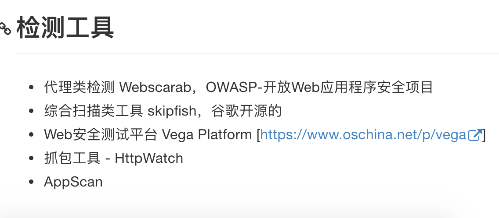
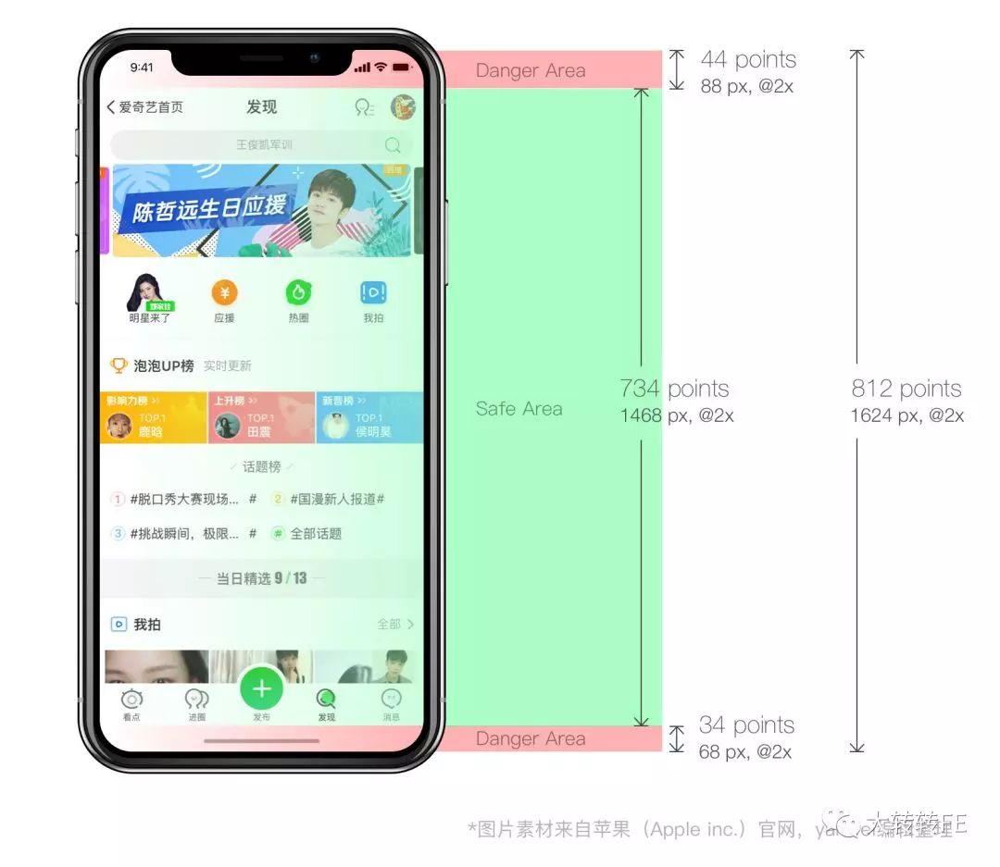

# 团队知识库

## HTML


### 嵌套规则


+ a标签不可以嵌套交互式元素 a input select button textarea audio和video(如果设置了controls属性) 等
+ 内联元素不能包含块级元素
+ p标签不能包含块级元素
+ ul的子元素应该只有li
+ 元素并排（块级和块级并列，内联和内联并列)
+ 行内元素强制转成块级元素，块级元素强制转成行内元素
+ h1、h2、h3、h4、h5、h6、p 不可包含块级标签
+ li标签可以包含div以及ul

### meta


#### pc端


```html
<meta charset="utf-8" /> 
<meta http-equiv="X-UA-Compatible" content="IE=edge,chrome=1">
<meta name="robots" content="all">
<meta name="author" content="Tencent-CP" />
<meta name="Copyright" content="Tencent" />
<meta name="Description" content="页面的描述内容" />
<meta name="Keywords" content="页面关键字" />
```


#### 移动端


```html
<!-- 字符集 -->
<meta charset="utf-8" /> 

<!-- 视口： -->
<meta name="viewport" content="width=device-width,initial-scale=1,minimum-scale=1,maximum-scale=1,user-scalable=no">

<!-- 为了防止页面数字被识别为电话号码，可根据实际需要添加： -->
<meta name="format-detection" content="telephone=no"> 

<!-- 让添加到主屏幕的网页再次打开时全屏展示，可添加：   -->
<meta content="yes" name="mobile-web-app-capable">
<meta content="yes" name="apple-mobile-web-app-capable">

<!-- SEO -->
<meta name="robots" content="all">
<meta name="author" content="Tencent-CP" />
<meta name="Copyright" content="Tencent" />
<meta name="Description" content="页面的描述内容" />
<meta name="Keywords" content="页面关键字" />
```


#### eleme meta


```
<meta charset="utf-8">

<link rel="manifest" href="//h5.ele.me/manifest.json">
<meta name="format-detection" content="telephone=no, email=no">
<meta name="description" content="饿了么是中国专业的网上订餐平台，目前已覆盖北京、上海、杭州、广州等300多个城市，提供各类中式、日式、韩式、西式、下午茶、夜宵等优质美食，并提供送餐上门服务，让订餐更加轻松，叫外卖就上饿了么！">
<meta name="keywords" content="饿了么，网上订餐，外卖，快餐外卖，外卖网">

<meta name="apple-mobile-web-app-title" content="饿了么">
<meta name="theme-color" content="#0096ff">
<link rel="apple-touch-startup-image" href="//h5.ele.me/startup.png">
<meta http-equiv="x-dns-prefetch-control" content="on">

<meta name="Alipay:title" content="饿了么外卖">
<meta name="Alipay:imgUrl" content="https://h5.ele.me/logo-96x96.png">
<meta name="Alipay:desc" content="用饿了么点外卖：美好生活，触手可得。">

<meta name="aplus-exinfo" content="EXPARAMS">
<meta name="spm-id" content="a2ogi.12117543">

<link rel="dns-prefetch" href="//fuss10.elemecdn.com">
<link rel="dns-prefetch" href="//shadow.elemecdn.com">
<link rel="dns-prefetch" href="//g.alicdn.com">

<link rel="preconnect" href="//fuss10.elemecdn.com">
<link rel="preconnect" href="//shadow.elemecdn.com">
<link rel="preconnect" href="//g.alicdn.com">
```


### manifest.json


Web应用程序清单在一个JSON文本文件中提供有关应用程序的信息（如名称，作者，图标和描述）。manifest 的目的是将Web应用程序安装到设备的主屏幕，为用户提供更快的访问和更丰富的体验。


Web应用程序清单是被称为渐进式Web应用程序(PWA)的Web技术集合的一部分, 它们是可以安装到设备的主屏幕的网络应用程序，而不需要用户通过应用商店，伴随着其他功能, 比如离线可用和接收推送通知。


```
{
  "name": "饿了么",
  "short_name": "饿了么",
  "description": "饿了么是中国专业的网上订餐平台，目前已覆盖北京、上海、杭州、广州等300多个城市，提供各类中式、日式、韩式、西式、下午茶、夜宵等优质美食，并提供送餐上门服务，让订餐更加轻松，叫外卖就上饿了么！",
  "lang": "cn",
  "icons": [
    {
      "src": "logo-192x192.png",
      "type": "image/png",
      "sizes": "192x192"
    },
    {
      "src": "logo-144x144.png",
      "type": "image/png",
      "sizes": "144x144"
    },
    {
      "src": "logo-96x96.png",
      "type": "image/png",
      "sizes": "96x96"
    },
    {
      "src": "logo-72x72.png",
      "type": "image/png",
      "sizes": "72x72"
    },
    {
      "src": "logo-48x48.png",
      "type": "image/png",
      "sizes": "48x48"
    },
    {
      "src": "logo-36x36.png",
      "type": "image/png",
      "sizes": "36x36"
    }
  ],
  "start_url": "/msite/#pwa=true",
  "display": "standalone",
  "orientation": "portrait",
  "theme_color": "#0096ff",
  "background_color": "#fff",
  "related_applications": [
    {
      "platform": "play",
      "id": "me.ele",
      "url": "https://play.google.com/store/apps/details?id=me.ele"
    },
    {
      "platform": "itunes",
      "url": "https://itunes.apple.com/app/e-le-me-wai-mai-ding-can-mei/id507161324"
    }
  ]
}
```


## CSS


### 浏览器私有属性


[https://guide.aotu.io/docs/css/webkit.html#webkit-touch-callout](https://guide.aotu.io/docs/css/webkit.html#webkit-touch-callout)


### -webkit-scrollbar
滚动条


### -webkit-touch-callout
属性：none


当你触摸并按住触摸目标时候，禁止或显示系统默认菜单。在iOS上，当你触摸并按住触摸的目标，比如一个链接，Safari浏览器将显示链接有关的系统默认菜单，这个属性可以让你禁用系统默认菜单。


### -webkit-tap-highlight-color
在 iOS Safari 上，当用户点击链接或具有 JavaScript 可点击脚本的元素，系统会为这些被点击元素加上一个默认的透明色值，该属性可以覆盖该透明值。


兼容性

iOS 1.1.1及更高版本的Safari浏览器可用

大部分安卓手机


### -webkit-overflow-scrolling
属性：touch：原生样式滚动


```
> ios当前还只对<body>下的 overflow 默认产生弹性滚动效果
>
> 在非body下我们实现弹性滚动  
-webkit-overflow-scrolling: touch;
>

```

### -webkit-line-clamp
多行文本限制行数


### -webkit-appearance
属性 none：去除系统默认 appearance 的样式，常用于 iOS 下移除原生样式


 

### -webkit-text-size-adjust: 100%;
定义 iOS Safari 网页文本大小调整属性


兼容性

iOS 1.0 及更高版本

Safari on iOS only

安卓尚不明确


### -webkit-user-select: none
禁止选择

### -webkit-marquee
定义滚动文本内容属性（缩写属性，类似margin）。


兼容性

iOS 1.0 及更高版本

Safari 3.0 及更高版本

大部分安卓手机


### -webkit-sticky


兼容性

iOS 6.1 及更高版本

iOS only


### 
### CSS属性书写顺序
建议遵循以下顺序：


布局定位属性：display / position / float / clear / visibility / overflow

自身属性：width / height / margin / padding / border / background

文本属性：color / font / text-decoration / text-align / vertical-align / white- space / break-word

其他属性（CSS3）：content / cursor / border-radius / box-shadow / text-shadow / background:linear-gradient …


### 禁止使用层级过深的选择器，最多3级。


### class命名

```
.wrap{}                 //外层容器

.mod-box{}              //模块容器

.btn-start{}            //开始

.btn-download-ios{}     //ios下载

.btn-download-andriod{} //安卓下载

.btn-head-nav1{}        //头部导航链接1

.btn-news-more{}        //更多新闻

.btn-play{}             //播放视频

.btn-ico{}              //按钮ico

.btn-lottery{}          //开始抽奖

.side-nav{}             //侧栏导航

.side-nav-btn1{}        //侧栏导航-链接1

.btn-more{}             //更多
```


实在没办法 用这个 [https://unbug.github.io/codelf/](https://unbug.github.io/codelf/)


### 图片命名


bg.jpg          //背景图片

mod-bg.jpg      //模块背景

sprites.png     //精灵图

btn-start.png   //开始按钮

ico-play.png    //修饰性图片


### 禁止菜单 长按复制


```css
html, body {
    -webkit-user-select: none;   /* 禁止选中文本 */
    user-select: none;
}

a, img {
    -webkit-touch-callout: none; /* 禁止长按链接与图片弹出菜单 */
}
```


### 方法论


方法论

+ [BEM](https://link.juejin.im/?target=https%3A%2F%2Fcss-tricks.com%2Fbem-101%2F) - 🔥 BEM命名规范
+ [OOCSS](https://link.juejin.im/?target=https%3A%2F%2Fgithub.com%2Fstubbornella%2Foocss%2Fwiki)
+ smacss


## 前后端协作规范


### 接口规范
+ [RESTful](https://link.juejin.im?target=https%3A%2F%2Fzh.wikipedia.org%2Fzh-hans%2F%25E8%25A1%25A8%25E7%258E%25B0%25E5%25B1%2582%25E7%258A%25B6%25E6%2580%2581%25E8%25BD%25AC%25E6%258D%25A2): RESTful是目前使用最为广泛的API设计规范, 基于HTTP本身的机制来实现.
+ [JSONRPC](https://link.juejin.im?target=http%3A%2F%2Fwiki.geekdream.com%2FSpecification%2Fjson-rpc_2.0.html) 这是一种非常简单、容易理解的接口规范。相对于RESTful我更推荐这个，简单则不容易产生分歧，新手也可以很快接受.
+ [GraphQL](https://link.juejin.im?target=https%3A%2F%2Fgraphql.org%2Flearn%2F) 🔥更为先进、更有前景的API规范。但是你要说服后端配合你使用这种标准可能很有难度


### 接口设计注意的点


1. 接口版本化，保持向下兼容


### 登录态管理
#### session


优缺点：


1. session存储在服务器上, 服务器要存储所有用户的sessionId,会浪费大量空间
2. session存储在会话服务器上，如果一旦机器A挂掉，sessionId也就没有了
3. 使用cookie来做验证的话，可能会遭到CSRF攻击


#### JWT


json web token


1. 客户端第一次访问服务器时，服务器分配给客户端一个token
2. 客户端每次发起请求都携带token，服务器将header和payload结合加密算法和秘钥（只有服务端知道）进行一次加密，比较这次加密的结果和客户端给的第三部分是否相同即可

## 设计规范


移动端设计稿推荐设计尺寸：750x1624px，重要内容在安全区域内：646x1206px


首屏范围的设定选取的主流机型IPHONE6的分辨率大小，安全宽高为向下兼容到iphone5s的尺寸。


### 图标热区

```
<font style="color:#F5222D;">热区大小 最小面积：44x44像素</font>
```

图形大小 最小面积：30x30像素


## rem布局


k是设计稿的宽度


**使用rem进行页面布局，计算fontsize的JS脚本放置在头部的style之前。**


```plain
<script> 
    //屏幕适应 
    (function (win, doc) {
        if (!win.addEventListener) return;
        var html = document.documentElement;
        function setFont() {
            var html = document.documentElement;
            var k = 640;
            html.style.fontSize = html.clientWidth / k * 100 + "px";
        }
        setFont();
        setTimeout(function () {
            setFont();
        }, 300);
        doc.addEventListener('DOMContentLoaded', setFont, false);
        win.addEventListener('resize', setFont, false);
        win.addEventListener('load', setFont, false);
    })(window, document);
</script>
```


用 onorientationchange 函数来检测屏幕旋转，在一些APP或游戏内嵌页面会有该函数不会执行、orientation获取不到的情况。所以如果是游戏app内嵌页建议使用 resize 事件，检查宽高变化来检测屏幕是否旋转。


不管你拿到的设计稿宽度是640px还是750px，多大都一样。和我们平时做PC页面的做法基本一样，只需要把单位px换算成rem，所有设计稿的的元素大小全除以100单位换成rem，例如设计稿上个某个文字的大小为30px，直接写font-size:0.3rem。


**大小为1px的元素不要使用rem，直接用px**


## 音视频、图形
### 图形
alloyimage

****

### 音频


#### 微信背景音乐不能自动播放，


音频在H5页面中通常做为背景音乐，有些需求要求实现自动播放


解决方法：

+ 页面设计中添加播放音乐的开关，通过交互操作实现音乐的播放；
+ 微信或APP场景中通过监听WeixinJSBridgeReady事件、DOMContentLoaded事件；
+ 通过手势事件播放音乐，监听body的touchstart事件，回调中播放音乐；


## 前端安全


+ 页面中不要引用外部CDN资源的JavaScript文件、CSS文件
+ 对用户输入的内容进行安全性验证


XSS防御备忘录中文版

[https://www.zybuluo.com/laodao/note/9592](https://www.zybuluo.com/laodao/note/9592)


## 异常监控


### 收集异常数据
1. 全局捕获。例如使用window.onerror
2. 主动上报。在try/catch中主动上报.
3. 未处理的 Promise Error 监听window. unhandledrejection事


### 检测工具


## 
## iPhoneX适配


## 

iPhoneX底部的危险区域高度为34pt


第一步 设置meta标签 

新增 viweport-fit 属性，使得页面内容完全覆盖整个窗口：
```
<meta name=“viewport” content=”initial-scale=1, viewport-fit=cover”>
```


第二步 页面主体内容限定在安全区域内

```plain
body {
  padding-bottom: constant(safe-area-inset-bottom);
  padding-bottom: env(safe-area-inset-bottom);
}
```


第三步 fixed元素的处理


```plain
{
  margin-bottom: constant(safe-area-inset-bottom);
  margin-bottom: env(safe-area-inset-bottom);
}
```


## 调试


### 本地代码调试线上页面


+ zanproxy
+ chales代理
+ anyproxy


将远程请求的资源map到本地来


### 移动端调试


+ 控制台vconsole
+ eruda
+ chrome://inspect


### 安卓的vconsole
安卓访问下面这个链接，然后就会自带vconsole

[https://debugx5.qq.com/](https://debugx5.qq.com/)


### devtools 过滤chrome-extension的请求
-scheme:chrome-extension


## 文档查阅


[https://devhints.io/](https://devhints.io/)

[http://devdocs.io/](http://devdocs.io/)

[印记中文](https://docschina.org/)

dash APP

[https://cssreference.io/](https://cssreference.io/)

火狐mdn网站 ****


## 
## 前端开发流程


1. 开发规范
2. 模块化/组件化开发、
3. 组件库 npm
4. 性能优化
5. 项目部署 静态资源缓存 cdn 非覆盖式发布
6. 开发流程  本地开发调试-> 视觉确认->前后端联调->提测->上线
7. 测试


## 流程图


+ process On 收费。。
+ 百度 脑图
+ 印象笔记 脑图
+ wps 脑图


## JS教程


+ [https://javascript.info/](https://javascript.info/)
+ javascript-algorithms
+ [https://www.quirksmode.org/js/contents.html](https://www.quirksmode.org/js/contents.html)
+ [http://exploringjs.com/es6/index.html#toc_ch_modules](http://exploringjs.com/es6/index.html#toc_ch_modules)
+ [https://github.com/mbeaudru/modern-js-cheatsheet](https://github.com/mbeaudru/modern-js-cheatsheet)
+ [https://github.com/15Dkatz/es6-tutorial](https://github.com/15Dkatz/es6-tutorial)


## 网络相关


### ping检测


[http://ping.chinaz.com/](http://ping.chinaz.com/)


### DNS


> ## 域名解析
>
> @ 访问qcloud.com 解析的
>
> * 泛解析 匹配*.qcloud.com
>
> www
>
> 二级域名
>


### CDN


内容分发网络（Content Delivery Network），通过将服务内容分发至全网加速节点，利用全球调度系统使用户能够在就近节点获取所需内容，有效降低访问延迟，提升服务可用性


## 模拟用户行为


+ puppeteer
+ selenium
+ 油猴+jquery


## 前端代码质量


[https://juejin.im/post/5b911f306fb9a05cdb1013b9#heading-0](https://juejin.im/post/5b911f306fb9a05cdb1013b9#heading-0)


1. 指定编码规范  参考es6编程风格、Vue风格指南
2. 开发工作流lint风格强制检查  
添加.editorconfig文件  
配置Git Hook强制执行编程风格检测与修正
3. 定期Code Review  
如 GitHub 上许多流行项目采用 PR(Pull Request) 工作流的方式，一个 PR 至少经过三人次 review 通过才能合入，这能从流程上较好地保障项目代码质量。在有的开发团队或企业，会引入 gerrit 这种代码审核平台，过程与此大致相似。
4. 单元测试


另外需注意，单元测试的执行一定要与 CI 集成，才能真正发挥它实时性反馈问题的作用。


## 捕获异常


### window.onerror
+ 无法捕获语法错误 script error (外链JS错误)
+ 无法捕捉静态资源异常 资源路径错误
+ XHR接口异常，错误都无法捕获到


window.onerror 函数只有在返回 true 的时候，异常才不会向上抛出 控制台才不会显示错误


### Script error 第三方脚本错误

```
<font style="color:#F5222D;">原因，隐藏跨域的脚本Error信息</font>

<font style="color:#F5222D;"></font>

一般来说 是跨域的脚本报错了 但是看不到具体的报错信息 我们可以在script 引入的时候加上crossorigin="anonymous"，并且服务端返回正确的跨域响应头

<font style="color:#F5222D;"></font>
```
参考

[https://blog.sentry.io/2016/05/17/what-is-script-error](https://blog.sentry.io/2016/05/17/what-is-script-error)


#### 方法1 设置跨域头

```
1) script标签设置crossorigin属性

> <script src="http://another-domain.com/app.js" crossorigin="anonymous"></script>
>

2) 后端返回跨域请求头 

> Access-Control-Allow-Origin: *
>
```


#### 方法2，try/catch


```html
<!-- note: crossorigin="anonymous" intentionally absent -->
<script src="http://another-domain.com/app.js"></script>
<script>
window.onerror = function (message, url, line, column, error) {
  console.log(message, url, line, column, error);
}

try {
  foo(); // call function declared in app.js
} catch (e) {
  console.log(e);
  throw e; // intentionally re-throw (caught by window.onerror)
}
</script>
```


### unhandled rejection


没有写 catch 的 Promise 中抛出的错误无法被 onerror 或 try-catch 捕获到


为了防止有漏掉的 Promise 异常，建议在全局增加一个对 unhandledrejection 的监听，用来全局监听Uncaught Promise Error


```javascript
window.addEventListener("unhandledrejection", function(e){

 console.log(e);

});
```


### 监控网页崩溃：window 对象的 load 和 beforeunload


### img标签 上报错误


对于捕获的错误需要上传给服务器，通常可以通过 img 标签的 src 发起一个请求


### 线上代码debug


见过一些大网站，压缩后把 sourcemap 文件丢 production 服务器上，一打开开发者工具，又下载 3~5M （而且还不显示）。而且还可以把这个 map 下载到本地，用工具还原出整个前端，分析学习。


https://github.com/pavloko/source-map-unpack


**source-map不要传到线上去**


### 方案


sentry  
arms


## vs code 全部折叠


mac下


全选之后 cmd + k 然后 cmd + num（1， 2， 3， 4）可以选择折叠级别


0，折叠所有代码块。


展开

command + k + j，展开所有代码块。


## APM


APM全称是Application Performance Management，即**应用程序性能监控**。APM可以全方位监控系统运行状态，能够让我们获取详细的数据，包括系统响应时间，吞吐量，定位缓慢的事务，找到应用的瓶颈。


事务（Transaction)。

这里的事务并非是数据库事务，而是应用对一次请求的处理。

从接到请求到响应处理完成的过程为称为一次事务


174rpm 每分钟请求数


> 更新: 2020-03-13 18:23:02  
> 原文: <https://www.yuque.com/u3641/dxlfpu/tvnc6o>