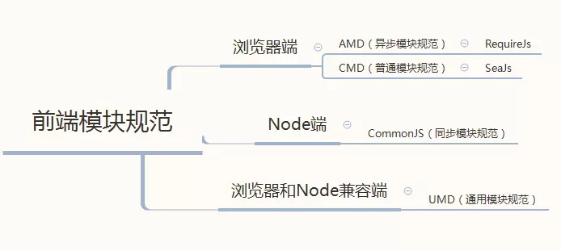
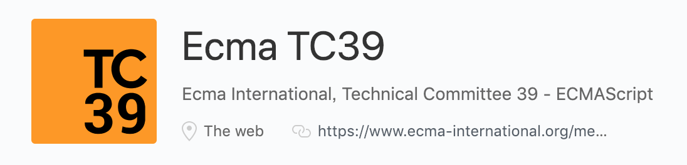
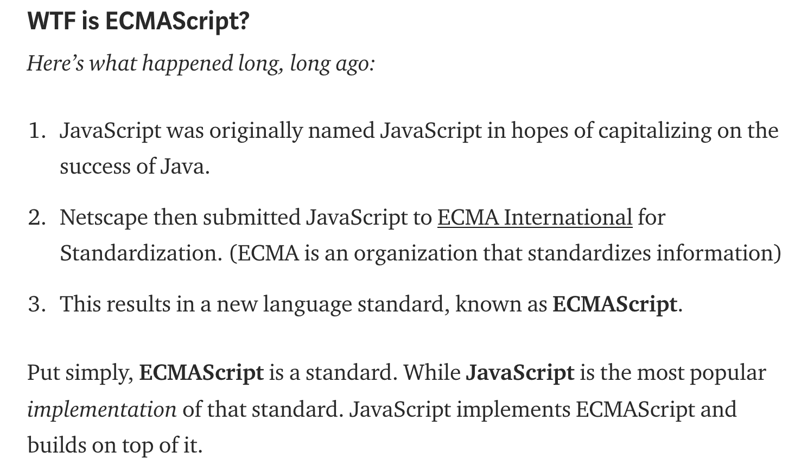
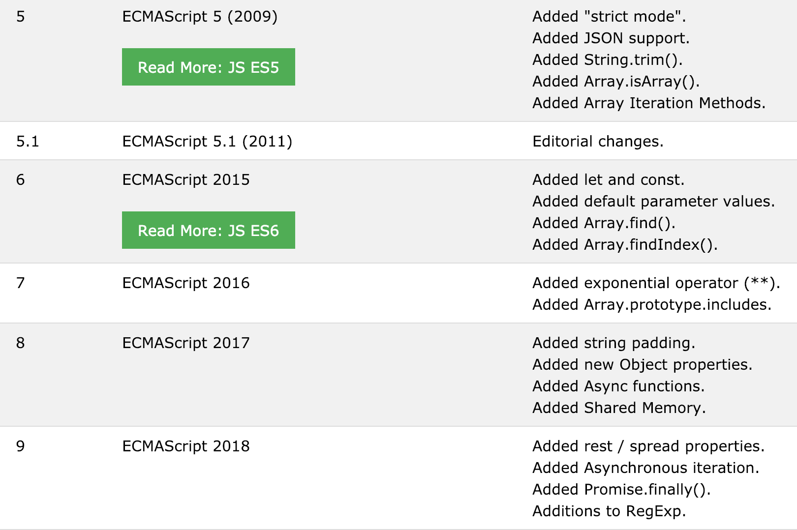
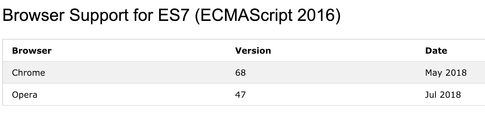
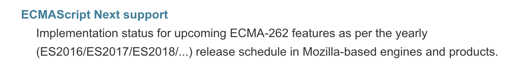
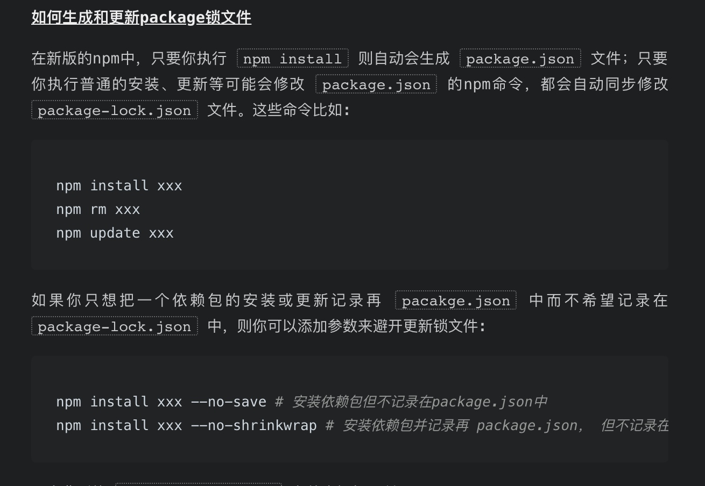

# 工程化

## browserlist
```plain
> 1%
last 2 versions
not ie <= 8
Android >= 4.0
```


Android for Android WebView.


可以使用npx browserslist 查看支持的浏览器


polyfill和autoprefixer都参考这个文件


## 模块规范


CMD就是个垃圾，seajs根本不想用。





### UMD
UMD兼容了AMD和CommonJS，同时还支持老式的“全局”变量规范


```javascript
    ;(function (root, factory) {
      if (typeof define === 'function' && define.amd) {
        // AMD
        define(factory);
      } else if (typeof exports === 'object') {
        // CommonJS
        module.exports = factory();
      } else {
        // window
        root.YourModule = factory();
      }
    
    }(this, function () {
      return {};
    }));
```


## npx
npm v5.2.0引入的一条命令（npx），引入这个命令的目的是为了提升开发者使用包内提供的命令行工具的体验。


```plain
npx create-react-app my-app
```


这条命令会临时安装 create-react-app 包，命令完成后create-react-app 会删掉，不会出现在 global 中。下次再执行，还是会重新临时安装。


```plain
npm i -D webpack
`npm bin`/webpack -v
```


## babel
Babel 是一个通用的多用途 JavaScript 编译器（Babel is a JavaScript compiler.）。


Use next generation JavaScript, today


通过 Babel 你可以使用（并创建）下一代的 JavaScript，以及下一代的 JavaScript 工具


Stable


babel6是目前稳定版本，babel7 pre release版本。


vue-cli3使用babel7 Babel 7 中的新配置格式 babel.config.js


### @babel/polyfill
polyfill 增加了全局范围以及像 String 这样的原生原型，来模拟完整的 ES2015+ 环境


这意味着你可以使用像 Promise 或 WeakMap 这样的新内置函数，和像 Array.from 或 Object.assign 这样的静态方法


对于库/工具的作者来说，太冗余了。如果你不需要像 Array.prototype.includes 这样的实例方法，**可以使用 transform runtime 插件**而不是使用污染全局的 @babel/polyfill


**试用了****transform runtime插件后，就不可以使用实例方法了。**This means you won't be able to use the instance methods mentioned above like Array.prototype.includes.


### preset-env


这个 preset 包括支持现代 JavaScript（ES2015，ES2016 等）的所有插件


### babel7
As of Babel v7, all the stage presets have been deprecated


所有stage-preset被废弃了


### babel-core
如果你需要以编程的方式来使用 Babel，可以使用 babel-core 这个包。


babel-core 的作用是把 js **代码分析成 ast** ，方便各个插件分析语法进行相应的处理。有些新语法在低版本 js 中是不存在的，如箭头函数，rest 参数，函数默认值等，这种语言层面的不兼容只能通过将代码转为 ast，分析其语法后再转为低版本 js


```javascript
require("@babel/core").transform("code", {
  plugins: ["@babel/plugin-transform-arrow-functions"]
});
```


## TC39
### TC39是什么？包括哪些人？
TC39是一个推动 JavaScript 发展的委员会，由各个主流浏览器厂商的代表构成。




### TC39 这群人主要的工作是什么？
制定ECMAScript标准，标准生成的流程，并实现


### stage


每一项新特性，要最终纳入ECMAScript规范中，TC39拟定了一个处理过程，称为TC39 process。

其中共包含5个阶段，Stage 0 ~ Stage 4。


+ Stage 0 - Strawman（展示阶段）
+ Stage 1 - Proposal（征求意见阶段）
+ Stage 2 - Draft（草案阶段）
+ Stage 3 - Candidate（候选人阶段）
+ Stage 4 - Finished（定案阶段）


---


+ Stage 4 means that a feature will be in the next release (or the one after that).
+ Stage 3 means that a feature still has a chance of being included in the next release.


[https://www.w3ctech.com/topic/2046](https://www.w3ctech.com/topic/2046)

[https://github.com/tc39/proposals](https://github.com/tc39/proposals)


## ECMAScript


ES1: June 1997 — ES2: June 1998 — ES3: Dec. 1999 —

 ES4: Abandoned 被抛弃了

ES5（2009年12月）

ES2015 (ES6) 2015年6月发布  2015代表released的年份，以后每个release都这样定义 6代表第6个版本

ES2016 ES7

...

ES2018 


因此，从ECMAScript 2016（ES7）开始，ECMAScript版本的发布将会变得更加频繁


> JavaScript was invented by Brendan Eich in 1995, and became an ECMA standard in 1997.
>
> ECMAScript is the official name of the language.
>
> From 2015 ECMAScript is named by year (ECMAScript 2015).
>





### 每年的release





### ES 2016浏览器支持情况





### ES Next


##   
[](https://github.com/tc39/proposals)


## JavaScript


一个完整的JavaScript实现是由以下3个不同部分组成的：核心(ECMAScript)、文档对象模型(DOM)、浏览器对象模型(BOM)


## eslint
0 1 2 对应off warning error三个级别


## npm
### 检测依赖升级工具
npm-check 简直不要太好用


npm remove 移除包

npm ls --depth 0 查看当前工程下的包

npm update 更新模块

npm publish 发布模块


### 取消发布
取消发布 npm unpublish name —force > 只有在发包的24小时内才允许撤销发布的包

npm unpublish的推荐替代命令：


npm deprecate [@]

使用这个命令，并不会在社区里撤销你已有的包，但会在任何人尝试安装这个包的时候得到警告

例如：npm deprecate penghuwanapp '这个包我已经不再维护了哟～'


### 生成 更新lock文件





## open命令打开浏览器
open localhost:7001


> 更新: 2021-04-29 09:46:55  
> 原文: <https://www.yuque.com/u3641/dxlfpu/of0oac>