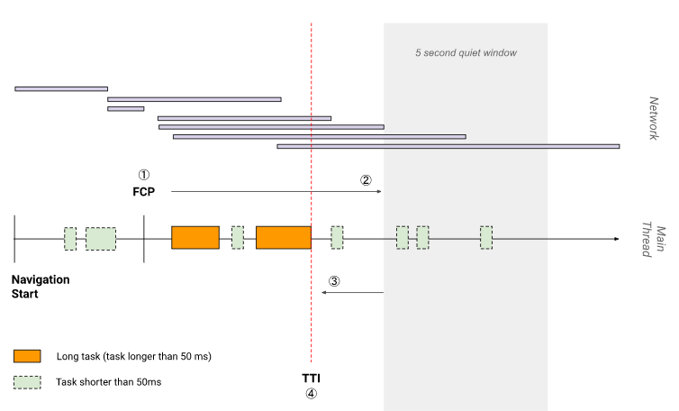
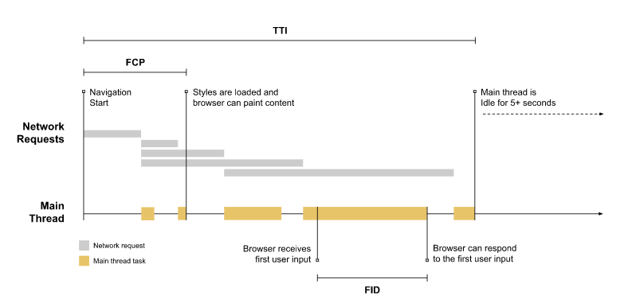

# Metrics

# Important metrics to measure
+ [First Contentful Paint (FCP)](https://web.dev/fcp/)
+ [Largest Contentful Paint (LCP)](https://web.dev/lcp/)
+ [First Input Delay (FID)](https://web.dev/fid/)
+ [Time to Interactive (TTI)](https://web.dev/tti/)
+ [Total Blocking Time (TBT)](https://web.dev/tbt/)
+ [Cumulative Layout Shift (CLS)](https://web.dev/cls/)


# LCP


```javascript
new PerformanceObserver((entryList) => {
  for (const entry of entryList.getEntries()) {
    console.log('LCP candidate:', entry.startTime, entry);
  }
}).observe({type: 'largest-contentful-paint', buffered: true});
```


# web-vitals


[https://github.com/GoogleChrome/web-vitals](https://github.com/GoogleChrome/web-vitals)

```javascript
import {getLCP, getFID, getCLS} from 'web-vitals';

getCLS(console.log);
getFID(console.log);
getLCP(console.log);

```


# TTI




# FID
First input delay





```javascript
new PerformanceObserver((entryList) => {
  for (const entry of entryList.getEntries()) {
    const delay = entry.processingStart - entry.startTime;
    console.log('FID candidate:', delay, entry);
  }
}).observe({type: 'first-input', buffered: true});
```


> 更新: 2021-05-15 15:19:33  
> 原文: <https://www.yuque.com/u3641/dxlfpu/zdt26n>