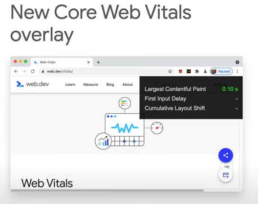

# core web vitals

> An initiative to provide unified guidance for quality signals that are essential to delivering a great user experience on the web.
>

[https://web.dev/learn-web-vitals/](https://web.dev/learn-web-vitals/)

# 指标内容
+ [Largest Contentful Paint (LCP)](https://web.dev/lcp/)
+ [First Input Delay (FID)](https://web.dev/fid/)
+ [Cumulative Layout Shift (CLS)](https://web.dev/cls/)

# 新加入overlay

> 更新: 2021-05-15 15:20:59  
> 原文: <https://www.yuque.com/u3641/dxlfpu/rkqwpe>