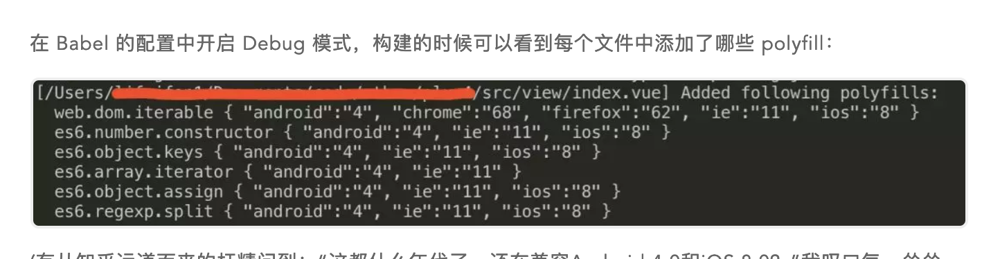
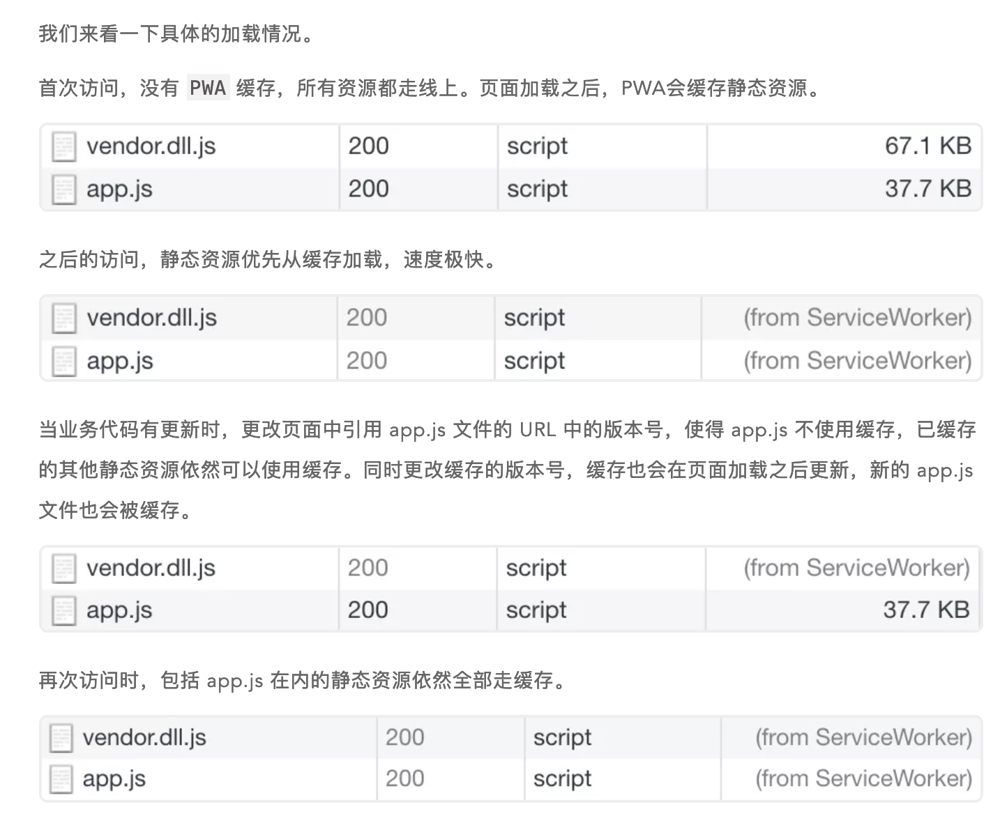

# 京东的PLUS会员前端性能优化

## 按需加载polyfill

**基于 Babel7 可以实现更智能的 Babel polyfill 按需加载**

****

polyfill 有多种方案，各有各的问题。目前**应用中**通常使用 babel-polyfill 方案，而第三方库中通常使用 babel-runtime 和 babel-plugin-transform-runtime 方案。

babel-polyfill 提供完整的环境垫片，包含所有 API 的降级模块，可以为新的 API 和全局对象上的方法提供兜底，其主要缺点是文件较大，压缩后大概八九十KB。目前项目中采用这种方案，这次考虑予以优化，减少加载的代码体积。

---

Babel7 主要是通过其提供的 @babel/preset-env 实现按需加载的。'usage'模式

同时，需要在 .browserslistrc 文件或者 .babelrc 的 targets 字段中指定需要兼容的浏览器范围。

@babel/preset-env 的 useBuiltIns 选项值设为 usage。这样 Babel 就会自动分析每一个文件并在考虑我们指定的浏览器兼容范围的情况下，为每个文件加载其需要的 polyfill 【.browserlisrtc】

这样 Babel 就会自动分析每一个文件并在考虑我们指定的浏览器兼容范围的情况下，为每个文件加载其需要的 polyfill。最终项目里只引入了部分 polyfill，经测算，打包后的代码(min)较直接引入完整 babel-polyfill 的方案小60多KB，同时还避免了全局变量污染。

  

---

比如按照我们指定的浏览器范围需要引入的某个 polyfill，对于高版本浏览器来说可能还是多余。

类似 polyfill.io 的服务端 polyfill 方案支持。未来我们会沿着这个方向继续探索。

## 持久化缓存

## webpack 构建工具升级到 4.0

## PWA
用 ServiceWorker 不缓存页面自身 HTML 和接口数据**，****只缓存静态资****源，**且优先使用缓存。非首次访问的情况下，静态资源都会走缓存，页面访问速度得以大幅提升

资源更新了，怎么办？

更新html页面的引用链接

不怎么动的依赖？每次都重新打包吗？

对于这些稳定公共模块的提取我们使用 webpack 内置的 DllPlugin 和 DllReferencePlugin 插件来实现，通过这两个插件提前对这些公共模块进行独立编译，打出一个 vendor.dll.js 的包，之后在这部分代码没有改动的情况下不再对它们进行编译，所以项目平时的构建速度也会提升不少。vendor.dll.js 包独立存在，hash 不会发生变化，特别适合持久化缓存。

  

## 骨架屏等方案

骨架屏指的是在页面数据加载完成前，先给用户展示出的页面大致结构

骨架屏能给人一种页面内容“已经渲染出一部分”的感觉，相较于传统的 loading 效果，体验更佳。

纯 DOM 形式的骨架屏代码，比图片、Canvas等形式数据量更小，调整起来也更灵活。

## webp
去年我们在项目里应用了 WebP 格式，收效不错。比如某张背景图片，压缩后的 png 格式是35KB，而转成 WebP 只有4KB，两者基本看不出质量上的差别。

WebP 为例，谷歌系的浏览器以及欧朋浏览器支持情况良好，Firefox、Edge 也都在新版本提供了支持，可惜苹果公司一直没有跟进，Safari 直到现在也没有要支持的迹象，iOS 上的应用如果想支持，还需自行打包解析库（经测试发现iOS版的京东APP已经提供了支持，点个赞）。

我们使用 WebP 的方式是在页面上通过JS判断当前浏览器是否支持 WebP，如果支持，则在 body 上增加一个名为 “webp” 的 class，同时把判断结果写入 localStorage，之后再进入页面时直接从 localStorage 里读取，不用每次都执行判断的代码了。然后在页面的 css 中通过 “.webp” 选择器、**在 Vue 的图片过滤器中通过判断结果来决定是否加载 WebP 格式图片。**

> 更新: 2019-03-08 14:10:31  
> 原文: <https://www.yuque.com/u3641/dxlfpu/pwe90g>