# 性能优化

## 理解性能指标


**Performance Api**


利用Performance Api可以得到下面的时间


 window.performance【目前IE9以上的浏览器都支持】 我们可以使用这个API配合打点，采样上报到我们的服务器上。要考虑采样率的问题


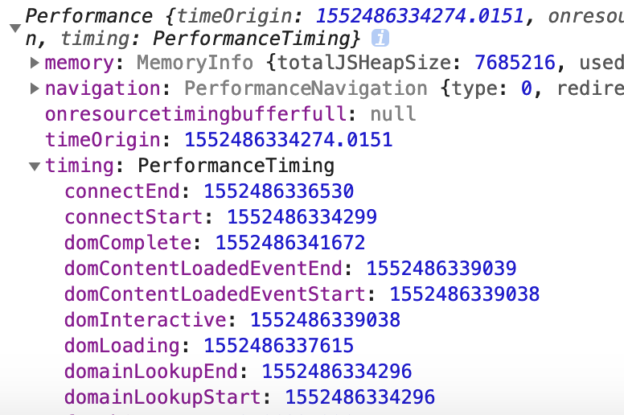


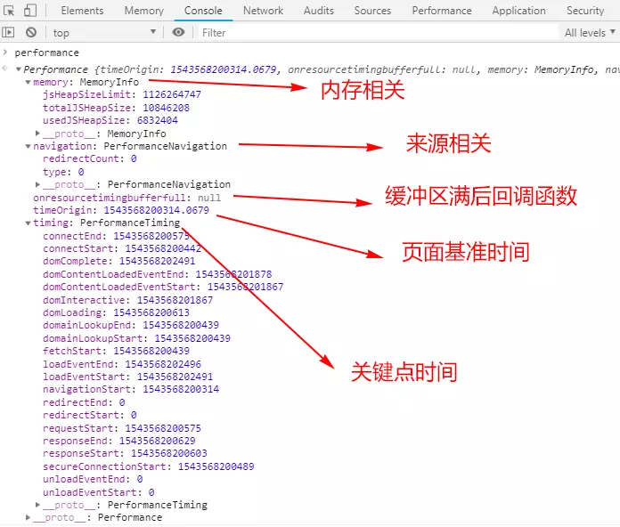


### 阶段耗时


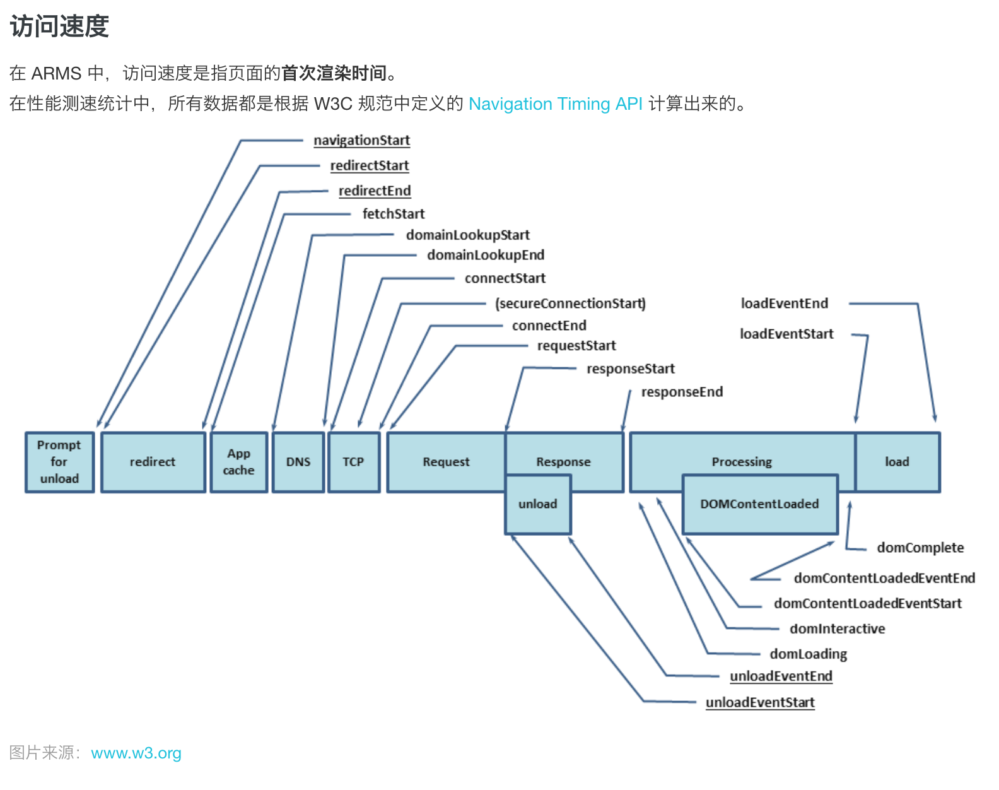


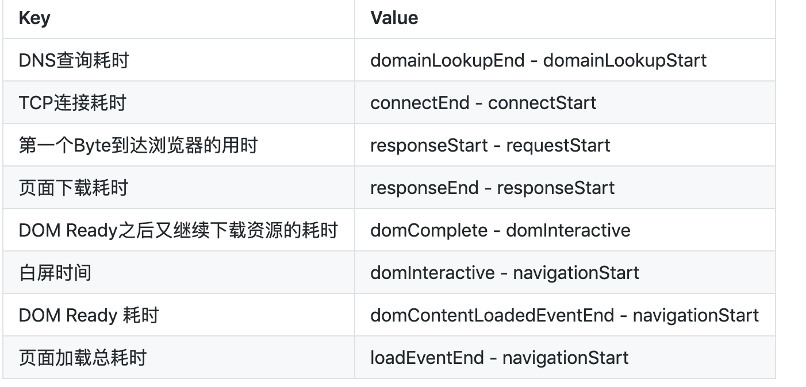


[ARMS统计指标说明](https://help.aliyun.com/document_detail/60288.html?spm=arms_retcode.retcode_console.0.0.26173352ClnGT8#%E8%AE%BF%E9%97%AE%E9%80%9F%E5%BA%A6)


### 访问速度


ARMS关注的<font style="color:#F5222D;">访问</font><font style="color:#F5222D;">速度</font>就是**页面首次渲染时间**


#### 一个CSR的页面加载时间


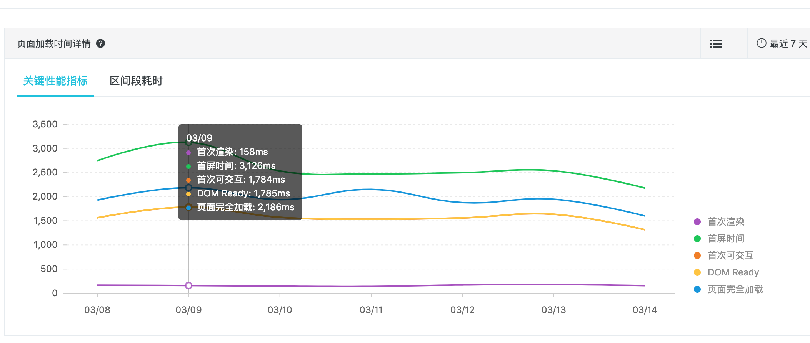


#### 一个SSR的页面加载时间
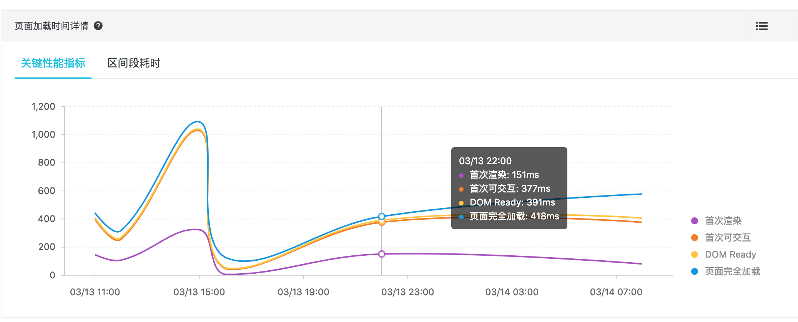


从上图可以看出，SSR的页面性能确实好很多。

****

### 关键性能指标

```
+ ttb：首个字节
+ <font style="color:#24292E;background-color:rgba(27, 31, 35, 0.05);">first-paint，即下面的 fpt，首次渲染，</font>这是开发人员在页面加载中关心的第一个关键时刻-当浏览器开始呈现页面时
+ first-contentful-pain，首次有内容的渲染，首次呈现文本、图片，这是用户第一次开始消费页面内容。
+ DOMContentLoaded
+ DOM ready

```


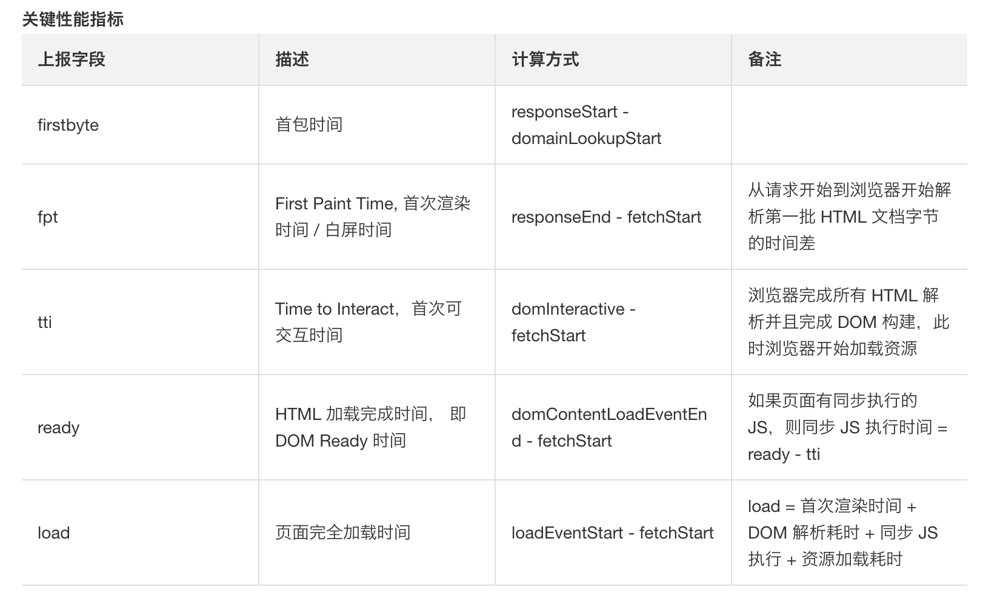


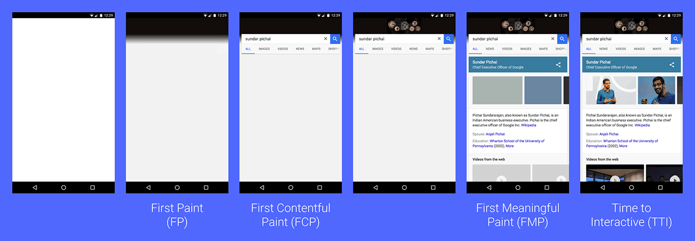


### 性能指标分析工具


ARMS


**Lighthouse**

可以在 chromedevtools 中运行 Lighthouse，也可以在命令行中运行，或者作为一个 Node 模块运行。

https://developers.google.com/web/tools/lighthouse/


## 优化方向


+ 优化页面渲染性能
+ http请求优化：优化response时间，使用缓存策略、减少http请求数、内联首屏css，减少http请求大小 优化http并发请求上限 考虑使用多个 CDN 域名


### dns-prefetch


典型的一次DNS解析需要耗费 20-120 毫秒（移动端会更慢

```

<link rel="dns-prefetch" href="//mat1.gtimg.com"  />

```


### 减少http请求


从大小、数量来看


1. 资源压缩合并 （雪碧图、小图可以使用base64、多个js文件合并为一个
2. 使用缓存 资源名称加 MD5 戳


### 优化TCP连接次数


http1.1，在HTTP的响应头会加上 Connection:keep-alive，当一个网页打开完成之后，连接不会马上关闭，再次访问这个服务时，会继续使用这个长连接。这样就大大减少了TCP的握手次数和释放次数


http2


### 优化页面渲染
* 懒加载（图片懒加载、下拉加载更多、进入可视区域才开始播放视频）

* CSS 放前面，JS 放后面

* 减少DOM 操作，多个操作尽量合并在一起执行（DocumentFragment

* 使用 SSR 后端渲染

* 使用requestAnimationFrame每 16 ms 刷新一次，渲染大数据量。

* 事件节流 因为浏览器是单线程 容易卡死浏览器


#### 如果CSS放在底部
CSS位置太靠后的话，在CSS加载之前，可能会出现闪屏、样式混乱、白屏等情况


#### 页面加载瀑布图
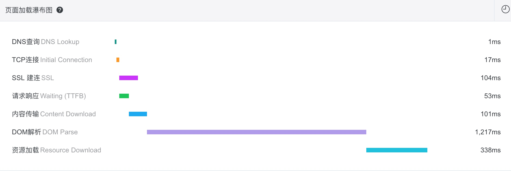


页面渲染阶段，从上往下


+ 构建DOM树
+ 构建CSSOM树
+ 两个数合并渲染树
+ layout
+ Painting
+ Display


#### defer和async
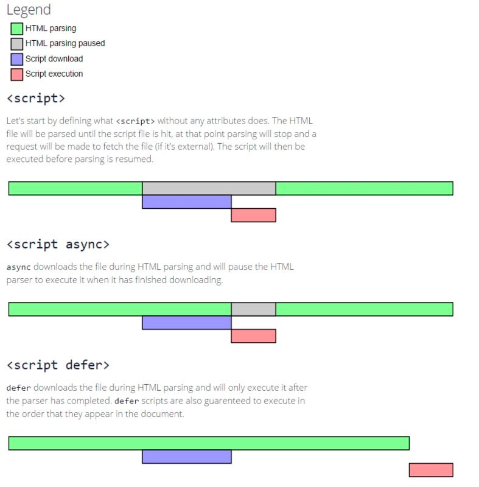


defer

+ defer 属性告诉浏览器它应该继续处理页面，并在“后台”下载脚本，然后<font style="color:#F5222D;">等页面处理完成后才开始执行此脚本</font>。
+ 具有 defer 属性的脚本总是要<font style="color:#F5222D;">等到 DOM 解析完毕</font>，但在 DOMContentLoaded 事件之前执行。

async

+ 页面不会等待异步脚本，它会继续处理页面并显示内容。
+ DOMContentLoaded 和 async 脚本不会彼此等待 <font style="color:#F5222D;">阻止DOM解析</font>
+ 动态添加的脚本表现为“async”行为。
+ <font style="color:#F5222D;">下载完成后就会执行</font>
+ <font style="color:#F5222D;">不保证执行顺序</font>


**总结**

async 和 defer 属性有一个共同点：它们都不会阻塞页面的渲染。因此，用户可以立即阅读并了解页面内容。


**使用场景**


defer 

依赖于页面中的DOM元素（文档是否解析完毕），或者被其他脚本文件依赖


评论框

代码语法高亮

polyfill.js


async

百度统计


> <font style="color:#F5222D;">在开发中，通常在脚本需要整个 DOM 文档或者脚本的相对执行顺序很重要的时候，使用 defer 属性。</font>
>
> <font style="color:#F5222D;">而当脚本之间互相独立，比如计数器或者广告，并且它们相对执行顺序不重要的时候，此时使用 async 属性。</font>
>


#### link preload prefetch 
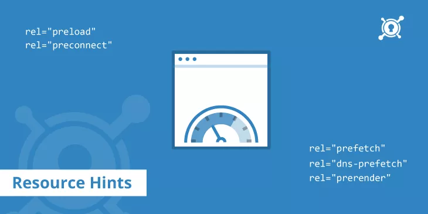


<font style="color:#F5222D;">preload</font>

<font style="color:#F5222D;"></font>

针对当前导航，最重要的资源进行提前加载，设为高的加载优先级。


> <link rel="preload" href="https://example.com/fonts/font.woff" as="font" crossorigin>
>


注意，不要预加载不需要的资源；

未使用的预加载会在 Chrome 中触发一个控制台警告，在开始加载后约3秒


**对脚本、样式表、字体、图片进行预加载。**


<font style="color:#F5222D;">prefetch</font>


对未来的导航所需要的资源，在后台进行加载。


<font style="color:#F5222D;">缓存表现</font>

Chrome 有四个缓存: HTTP 缓存、内存缓存、 Service Worker 缓存和 Push 缓存。

预加载和预取资源都存储在 HTTP 缓存中。


<font style="color:#F5222D;">as优先级</font>

使用“ as”属性的预加载资源与请求的资源类型具有相同的资源优先级。 例如，作为“ style”的预加载将获得最高优先级，而作为“ script”的预加载将获得低优先级或中优先级。 这些资源也服从相同的 CSP 策略(例如，脚本服从 script-src)。


#### 解析和渲染阶段


解析是指浏览器生成 DOM 树结构（此时用户不一定能看到，但脚本比如 querySelectorAll 可以访问到）；


渲染是指浏览器把 DOM 树与 CSS 结合进行布局并绘制到屏幕（此时用户是可以看到的）


#### CSS阻塞DOM渲染 不阻塞解析？


浏览器遇到script标签时，会去下载并执行js脚本，从而导致浏览器暂停构建DOM


CSS 不会阻塞后续 DOM 结构的解析，不会阻塞其它资源(如图片)的加载，但是**会阻塞 JS 文件的加载。因为**JS脚本需要查询CSS信息，所以****JS脚本还必须等待CSSOM树构建完****才可以执行。


> 如果css加载不阻塞DOM树渲染的话，那么当css加载完之后，DOM树可能又得重新重绘或者回流了，这就造成了一些没有必要的损耗。所以我干脆就先把DOM树的结构先解析完，把可以做的工作做完，然后等你css加载完之后，在根据最终的样式来渲染DOM树
>


以下结论:

**css加载不会阻塞DOM树的解析**

**css加载会阻塞DOM树的渲染**

**css加载会阻塞后面js语句的执行、**

****

## 性能优化检查清单
**  
**[http://lab.johnsenzhou.com/Front-End-Performance-Checklist/](http://lab.johnsenzhou.com/Front-End-Performance-Checklist/)


## 


> 更新: 2020-07-12 22:28:56  
> 原文: <https://www.yuque.com/u3641/dxlfpu/zhytd9>