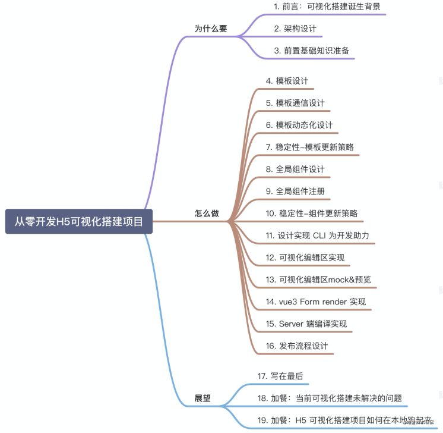

# 搭建

# 演讲：达达可视化搭建探索
达达集团内部有大量后台页面，以表单、表格、列表和静态文字图片为主，为了提升研发效率、减少重复开发，同时也在一定程度上提升系统稳定性，我主导了达达可视化搭建的探索。

目前已经完成了表单、静态页以及合同的可视化搭建。

截止 2020 年 Q3，表单配置化完成新增页面 90% 覆盖，40% 提效；静态页搭建完成新增页面 90% 覆盖，5 倍提效；合同可视化搭建覆盖 100% 新合同，无需开发动手，运营直接配置。

这次分享主要是分享整套可视化系统的搭建思路、过程，以及回顾问题，思考走了哪些弯路，如何解决。

资源：百度网盘

## 演讲大纲

+ 项目背景
+ 表单可视化搭建
+ 静态页可视化搭建
+ 合同可视化搭建
+ 可视化搭建平台整合
+ 应用情况和后续规划

# 掘金小册 - 从零开发H5可视化搭建项目

[https://www.yuque.com/u3641/dxlfpu/qirfmp](https://www.yuque.com/u3641/dxlfpu/qirfmp)

> 更新: 2021-05-15 16:36:53  
> 原文: <https://www.yuque.com/u3641/dxlfpu/cchi9n>