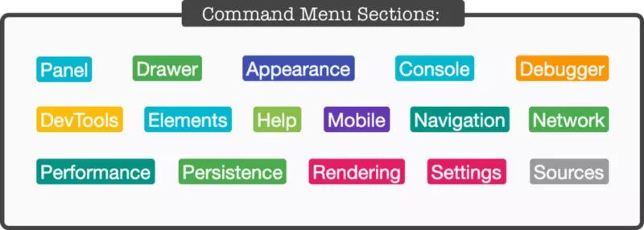
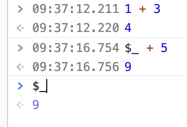

# devtool

## 命令列表
ctrl + shift + p

## $0
当前选中的html

**$_**

****

返回上一次控制台执行的内容

## console

1 console中打印出的对象，在你打印出他内容之前，是以引用的方式保存的。

2 搭配await 使用异步的console

> 更新: 2019-06-24 09:39:01  
> 原文: <https://www.yuque.com/u3641/dxlfpu/ew6eh8>