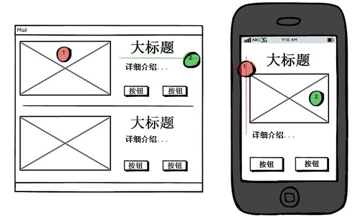
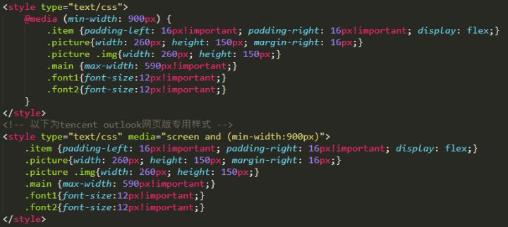

# 邮件模版开发指南

# 适配移动端



使用 media query 来做响应式处理，如果 style 标签支持不好，有必要使用行内样式




# 兼容性问题
Outlook

Gmail

iCloud


# 基本原则
```
+ 不支持JS
+ 只能使用 table 布局
+ 不要简写样式 padding: 12px; 写成 padding-left, padding-right
+ 充分利用表格的私有属性来布局。width, height, bgcolor, background, align, valign等
+ 不允许在<tr>元素上定义CSS样式，请将样式尽量定义在<td>元素上。（Gmail等邮件客户端会过滤<tr>上的属性）
+ 禁止使用<style type=”text/css”>来处理主要样式，所有的Web邮件系统都会过滤该标签
+ 表格不会继承外部的font等属性，请务必，在每个<td>元素上都定义字体属性和颜色
+ 背景的处理 不允许使用style=”background:url(http://…)”，请使用<td>的属性(attribute) background=“http://…”
+ 禁止使用 position, background, float 样式
+ 安全标签：<table>、<td>、<tr> <div>、<span>、<a>、
+ 移动端优先，使用响应式加载 PC 样式
```


# CSS 支持情况
[https://www.campaignmonitor.com/css/](https://www.campaignmonitor.com/css/)


# 验证
[https://htmlemail.io/inline/](https://htmlemail.io/inline/)


# MJML
[https://juejin.cn/post/6984600006334349342](https://juejin.cn/post/6984600006334349342)


> 更新: 2022-01-18 10:16:52  
> 原文: <https://www.yuque.com/u3641/dxlfpu/sldn6k>