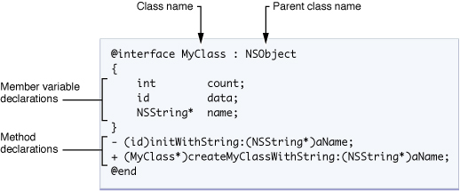
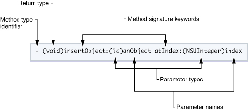

# Objective-C 语法看不懂

OC 是个啥啊，竟然看不懂。


扩展名

| <font style="color:rgb(51, 51, 51);">.h</font> | <font style="color:rgb(51, 51, 51);">头文件。头文件包含类，类型，函数和常数的声明。</font> |
| --- | --- |
| <font style="color:rgb(51, 51, 51);">.m</font> | <font style="color:rgb(51, 51, 51);">源代码文件。这是典型的源代码文件扩展名，可以包含 Objective-C 和 C 代码。</font> |


## hello world
```cpp
#import <Foundation/Foundation.h>

int main(int argc, char *argv[]) {

    @autoreleasepool {
        NSLog(@"Hello World!");
    }

   return 0;
}
```


## 变量


## 函数


## 接口


```cpp
@interface MyObject : NSObject {
    int memberVar1; // 实体变量
    id  memberVar2;
}

+(return_type) class_method; // 类方法

-(return_type) instance_method1; // 实例方法
-(return_type) instance_method2: (int) p1;
-(return_type) instance_method3: (int) p1 andPar: (int) p2;
@end
```


方法前面的 +/- 号代表函数的类型：

+ 加号（+）代表类方法（class method），不需要实例就可以调用，与C++ 的静态函数（static member function）相似。
+ 减号（-）即是一般的实例方法（instance method）。


```cpp
@interface Person : NSObject {
    @public
        NSString *name;
    @private
        int age;
}

@property(copy) NSString *name;
@property(readonly) int age;

-(id)initWithAge:(int)age;
@end
```

## 类 - 实现接口
```cpp
@implementation MyObject {
  int memberVar3; //私有實體變數
}

+(return_type) class_method {
    .... //method implementation
}
-(return_type) instance_method1 {
     ....
}
-(return_type) instance_method2: (int) p1 {
    ....
}
-(return_type) instance_method3: (int) p1 andPar: (int) p2 {
    ....
}
@end
```


```cpp
@implementation Person
@synthesize name;
@dynamic age;

-(id)initWithAge:(int)initAge
{
    age = initAge; // 注意：直接赋给成员变量，而非属性
    return self;
}

-(int)age
{
    return 29; // 注意：并非返回真正的年龄
}
@end
```


## 对象
Objective-C创建对象需通过alloc以及init两个消息。alloc的作用是分配内存，init则是初始化对象。 i

```cpp
// 创建对象
MyObject * my = [[MyObject alloc] init];
```

## 
## 方法调用


```cpp
obj.method(argument);

[obj method: argument];
```

## 控制语句


## yes no
```cpp
比如C#里你可以这么写：

this.hello(true);

在Objective-C里，就要写成：

[self hello:YES];
```


> 更新: 2021-05-13 20:41:35  
> 原文: <https://www.yuque.com/u3641/dxlfpu/ufudpp>