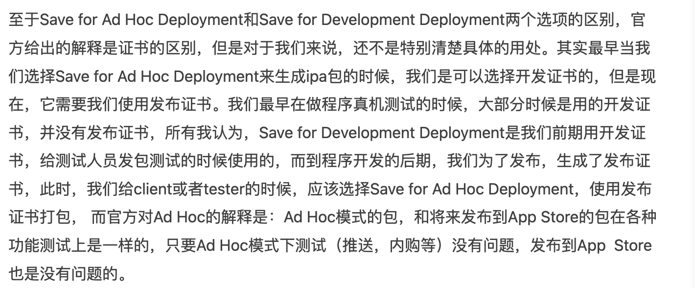

# Profile 类型

+ 1种是开发证书，用来给你（开发人员）做真机测试的；
+ 1种是发布证书，发布证书又分发布到app store的（这里不提及）和发布测试的ad hoc证书。
+ 要仅分发给注册设备上的有限用户 (例如，在您的组织内分发)，请选取“Ad Hoc”或“Development”(开发)。
+ 要使用 TestFlight 或通过 App Store 分发，请选取“App Store Connect”。

> 更新: 2023-03-24 14:22:07  
> 原文: <https://www.yuque.com/u3641/dxlfpu/ukpa2r>