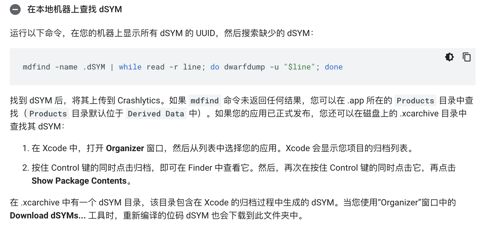

# firebase crashlytics

对于启用了位码且已发布到 App Store 或已提交到 TestFlight 的应用，您需要手动下载 dSYM 文件并提供给 Crashlytics


+ 从 App Store 下载位码 dSYM
+ 本地机器查找 dSYM





```ruby
DWARF_DSYM_FOLDER_PATH = /Users/wangqi/Library/Developer/Xcode/DerivedData/vibra-cqkgewglywfzivcenstbaeicguhr/Build/Products/Debug_beta-iphoneos
```


> 更新: 2023-03-24 14:22:12  
> 原文: <https://www.yuque.com/u3641/dxlfpu/kmah3m>