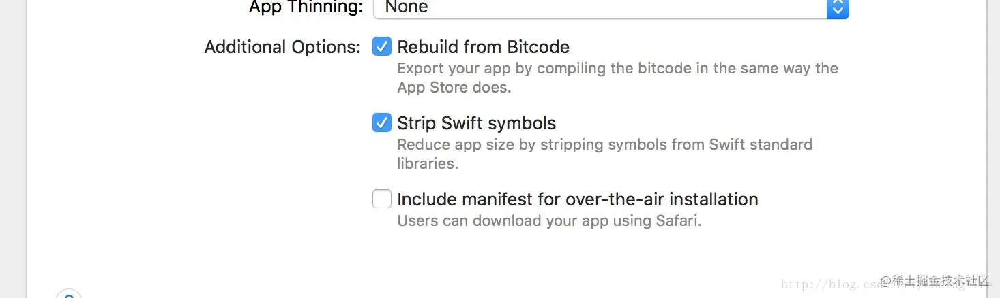
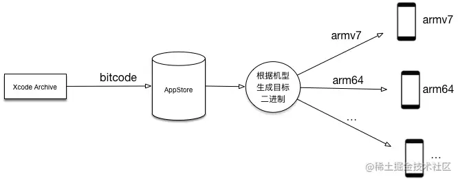
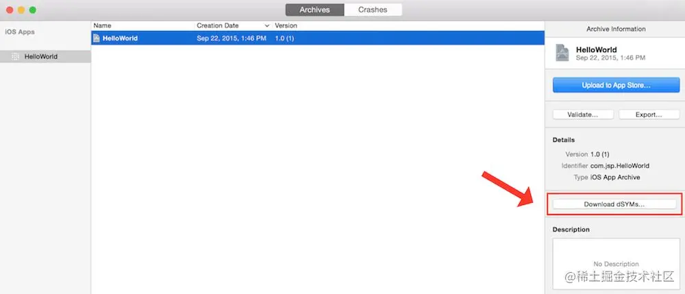
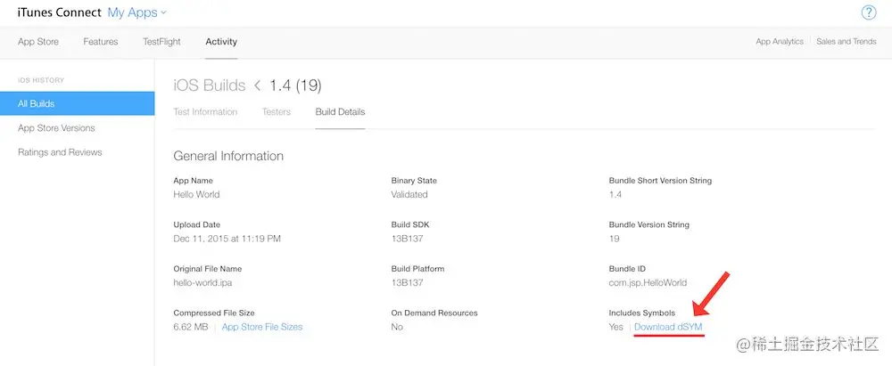

# iOS bitcode

苹果在WWDC 2015大会上引入了bitcode，随后在Xcode7中添加了在二进制中嵌入bitcode(Enable Bitcode)的功能，并且默认设置为开启状态。

**Rebuild from Bitcode**

> Xcode9之前我们项目中Bitcode很多时候都是设置为NO的，先来说下Bitcode的含义，Bitcode是被编译程序的一种中间形式的代码，包含bitcode配置的程序将会在App store上被编译和链接。bitcode允许苹果在后期重新优化程序的二进制文件，而不需要重新提交一个新的版本到App store上，这是苹果官方的解释，听起来还算通俗易懂，其作用其实就是让苹果对我们的编译代码进行一次优化，但至于苹果爸爸具体要做什么我们就无从得知了。考虑到不同的平台，iPhone可以选择开关，iwatch必须打开，max osx则完全不支持。因为一开始有些第三方库不支持bitcode，所以很多时候都是关闭的，但是苹果爸爸要做的事怎么可能就这样？随着越来越多的第三方库支持bitcode，这一项必然也是要被支持的，关于bitcode的解读，以上应该可以满足你的疑虑，如果还想有更深入的了解，大家可以搜索网上的详细帖子来查看，不过过多说明，毕竟都是纯理论的东西，也不好懂。\
>

**Strip swift symbols**

勾选这一项的话会对会让你的包内存小一些，对包进行了一个压缩，俗称去除swift符号。\

# 开启bitcode的优点
减少二进制包的大小；

> 简单说，以前是把所有的arm7、arm64平台的源码编译好，然后打成一个App；而开启Bitcode之后，可以使得开发者上传App时只需上传Intermediate Representation(中间件)，而非最终的可执行二进制文件。 在用户下载App之前，AppStore会自动编译中间件，产生设备所需的执行文件供用户下载安装。以后新设计了新指令集的新CPU，可以继续从这份bitcode开始编译出新CPU上执行的可执行文件，以供用户下载安装；
>
>   
作者：ijinfeng  
链接：https://juejin.cn/post/6968272595686785031  
来源：稀土掘金  
著作权归作者所有。商业转载请联系作者获得授权，非商业转载请注明出处。
>

# dSYM
> 编译器在编译过程（即把源代码转换成机器码）中，会生成一份对应的Debug符号表。Debug符号表是一个映射表，它把每一个编译好的二进制中的机器指令映射到生成它们的每一行源代码中。这些Debug符号表要么被存储在编译好的二进制中，要么单独存储在Debug Symbol文件中(也就是dSYM文件)：一般来说，debug模式构建的App会把Debug符号表存储在编译好的二进制中，而release模式构建的App会把Debug符号表存储在dSYM文件中以节省二进制体积。
>
> 
>
> 作者：超越杨超越
>
> 链接：[https://juejin.cn/post/6844904164208689166](https://juejin.cn/post/6844904164208689166)
>
> 来源：稀土掘金
>
> 著作权归作者所有。商业转载请联系作者获得授权，非商业转载请注明出处。
>

在每一次的编译中，Debug符号表和App的二进制通过构建时的UUID相互关联。每次构建时都会生成新的唯一标识UUID，不论源码是否相同。仅有UUID保持一致的dSYM文件，才能用于解析其堆栈信息。

# iOS App 瘦身

[iOS 瘦包常见方式梳理 - 掘金](https://juejin.cn/post/6844903709860691976)

# 下载 dSYM
> For Bitcode enabled builds that have been released to the iTunes store or submitted to TestFlight, Apple generates new dSYMs. You’ll need to download the regenerated dSYMs from Xcode and then upload them to Crashlytics so that we can symbolicate crashes.
>
> For Bitcode enabled apps, ensure that you have checked “Include app symbols for your application…” so that we can provide the most accurate crash reports.
>
>   
作者：iFangcy_  
链接：https://juejin.cn/post/6844903709860691976  
来源：稀土掘金  
著作权归作者所有。商业转载请联系作者获得授权，非商业转载请注明出处。
>

> 更新: 2023-03-24 14:21:51  
> 原文: <https://www.yuque.com/u3641/dxlfpu/szi2lt>