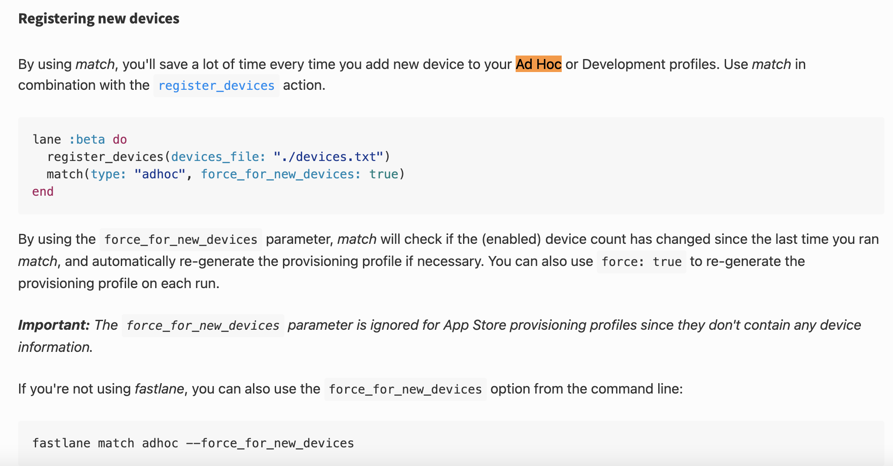

# 新同学导入证书

# 新同学导入证书
## 开发环境证书
fastlane match development --readonly

## 内测环境证书
fastlane match adhoc --readonly

Ad Hoc Distribution: 针对测试设备, 每个应用不能发不到超过100个设备上,发布前需要将每个设备的唯一编码打包进去

## 产品环境证书
fastlane match appstore --readonly

git仓库: git@gitlab.com:Keccak256-evg/gwave-mobile/vibra-apple-profile.git

密码: 2008bjAY!

## 添加新设备更新 adhoc 证书

# appStore 添加账号

> 更新: 2023-03-24 14:21:58  
> 原文: <https://www.yuque.com/u3641/dxlfpu/bltf3n>