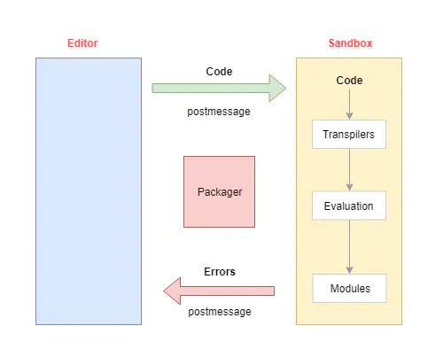

# codesandbox-client

在浏览器端模拟 webpack 的 development 模式

Sandbox 是一个iframe，通过 postmessage 和 Editor 通信

只能使用 CodeSandbox 预定义的 Preset

+ static
+ React
+ Vue
+ React + TS

使用 worker 来并行转译

目录

+ codesandbox-api: 封装了统一的协议，用于 sandbox 和 editor 之间通信(基于postmessage)
+ codesandbox-browserfs: 这是一个浏览器端的‘文件系统’，模拟了 NodeJS 的文件系统 API

参考

+ worker-loader: 将指定模块封装为Worker
+ babel: JavaScript代码转译，支持ES, Flow, Typescript
+ browserfs: 在浏览器中模拟Node环境
+ localForage: 客户端存储库，优先使用(IndexedDB or WebSQL)这些异步存储方案，提供类LocalStorage的接口
+ lru-cache: least-recently-used缓存

作者：荒山

链接：[https://juejin.im/post/6844903880652750862](https://juejin.im/post/6844903880652750862)

来源：掘金

著作权归作者所有。商业转载请联系作者获得授权，非商业转载请注明出处。

> 更新: 2020-09-21 11:38:03  
> 原文: <https://www.yuque.com/u3641/dxlfpu/gtynmg>