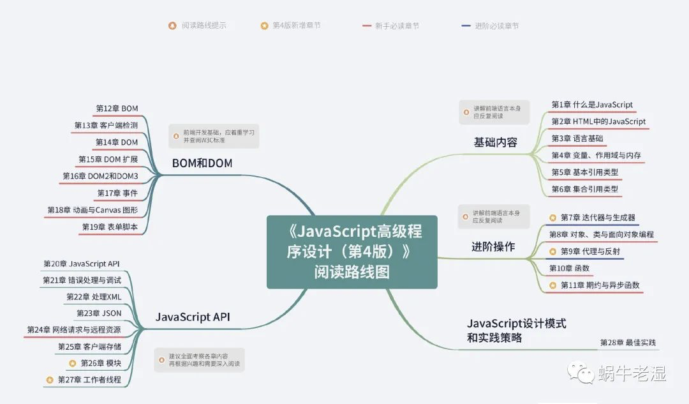

# JS 红宝书 第4版

前3章

第2章增加了 symbol

第3章的位运算，权限应用

第4章

除了基本类型外，其他都是引用类型，传递的时候都是引用

垃圾回收

第5、6章 内置引用类型

Date、RegExp、Object、Array、WeakMap、Map、Set

7、8、9章

for循环的劣势，迭代器解决的问题

实现可迭代协议

对象的configurable、enumberable、writable、value 

原型链和继承

es6的class

学习vue3 必备的 proxy 和 reflect，vue3 的 reactivity 模块

第10章 函数

尾递归优化

第11章 promise和async

现代前端必备的技能

建议关注 tc39 的语言规范，stage3 和 stage2，可以关注一下 class private fields

12-19 bom & dom

大部分内容都耳熟能详了

客户端检测，可以看一下 JS框架设计这本书

常见的dom操作

新的 mutationObserver 接口

dom3 的扩展，比如 querySelector

dom事件的复习

20-27 JS API

html5 新的API，web component

网络请求，比如跨域、fetch、beacon api 和 webSocket

客户端存储：cookie localStorage indexDB

es6的模块，JS的模块发展历史

web worker 工作者线程

> 更新: 2020-10-19 15:35:30  
> 原文: <https://www.yuque.com/u3641/dxlfpu/vf26op>