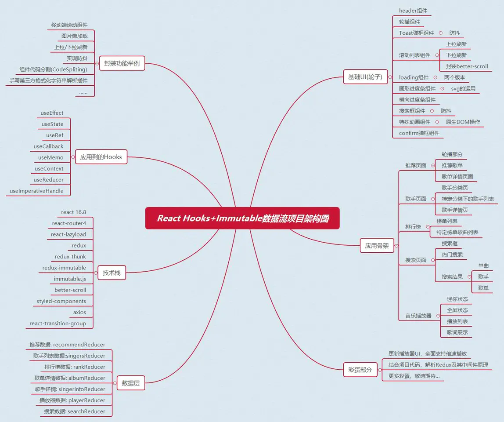

# 掘金小册 - React Hooks 与 Immutable 数据流实战

[https://juejin.cn/book/6844733816460804104](https://juejin.cn/book/6844733816460804104)

读完小册你会有什么收获:

1. 熟练使用React Hooks进行业务开发，理解哪些场景产生闭包陷阱，如何避免掉坑。
2. 手写近6000行代码，封装13个基础UI组件、12个业务组件，让你知道关于 React + Redux 业内公认的**最佳实践**到底是什么样子。
3. 封装常用的移动端组件，实现常见的需求，如封装滚动组件、实现图片懒加载、实现上拉/下拉刷新的功能、实现防抖功能、实现组件代码分割(CodeSpliting)等。
4. 拥有实现前端复杂交互的实际项目经验，提升自己的**内功**，比如开发播放器内核就是其中一个很大的挑战。
5. 掌握CSS中的诸多技巧，提升自己的CSS能力，无论布局还是动画，都有相当多的实践和探索，**未使用任何UI框架**，样式代码独立实现。
6. 彻底理解**redux原理**，并能够独立开发redux的中间件。

**技术栈**:

+ react v16.8全家桶(react，react-router): 用于构建用户界面的 MVVM 框架
+ redux: 著名JavaScript状态管理容器
+ redux-thunk: 处理异步逻辑的redux中间件
+ immutable: Facebook历时三年开发出的进行持久性数据结构处理的库
+ react-lazyload: react懒加载库better-scroll: 提升移动端滑动体验的知名库
+ styled-components: 处理样式，体现css in js的前端工程化神器
+ axios: 用来请求后端api的数据。

> 更新: 2021-04-30 14:54:07  
> 原文: <https://www.yuque.com/u3641/dxlfpu/nkygmm>