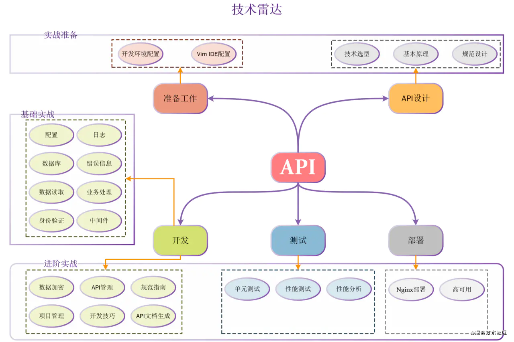

# 掘金小册 - 基于 Go 语言构建企业级的 RESTful API 服务

[https://juejin.cn/book/6844733730678898702](https://juejin.cn/book/6844733730678898702)

构建一个简单的 API 服务器很简单，但构建一个生产就绪的 API 服务还有很多工作要做。所谓的生产就绪，至少需要满足如下各方面：

1. 需要读取配置文件、记录日志
2. 需要连接数据库
3. 需要对数据库做增删改查等操作
4. 需要自定义业务错误码
5. 需要进行 API 身份验证
6. 需要给 API 增加 Swagger 文档
7. API 服务器需要满足高稳定性，高性能的要求
8. API 需要做高可用
9. ....

> 更新: 2021-04-30 14:52:13  
> 原文: <https://www.yuque.com/u3641/dxlfpu/zd5lhg>