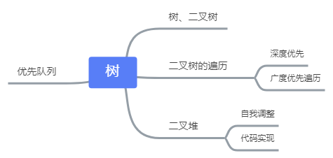

# 漫画算法 - 程序员小灰灰

# 目录
第1章　算法概述　/　1

1.1　算法和数据结构　/　1

1.1.1　小灰和大黄　/　1

1.1.2　什么是算法　/　3

1.1.3　什么是数据结构　/　7

1.2　时间复杂度　/　8

1.2.1　算法的好与坏　/　8

1.2.2　基本操作执行次数　/　10

1.2.3　渐进时间复杂度　/　12

1.2.4　时间复杂度的巨大差异　/　15

1.3　空间复杂度　/　16

1.3.1　什么是空间复杂度　/　16

1.3.2　空间复杂度的计算　/　19

1.3.3　时间与空间的取舍　/　21

1.4　小结　/　22

第2章　数据结构基础　/　23

2.1　什么是数组　/　23

2.1.1　初识数组　/　23

2.1.2　数组的基本操作　/　26

2.1.3　数组的优势和劣势　/　32

2.2　什么是链表　/　33

2.2.1 “正规军”和“地下党”　/　33

2.2.2　链表的基本操作　/　35

2.3　栈和队列　/　42

2.3.1　物理结构和逻辑结构　/　42

2.3.2　什么是栈　/　43

2.3.3　栈的基本操作　/　44

2.3.4　什么是队列　/　45

2.3.5　队列的基本操作　/　46

2.3.6　栈和队列的应用　/　50

2.4　神奇的散列表　/　51

2.4.1　为什么需要散列表　/　51

2.4.2　哈希函数　/　54

2.4.3　散列表的读写操作　/　55

2.5　小结　/　59

第3章　树　/　61

3.1　树和二叉树　/　61

3.1.1　什么是树　/　61

3.1.2　什么是二叉树　/　64

3.1.3　二叉树的应用　/　67

3.2　二叉树的遍历　/　71

3.2.1　为什么要研究遍历　/　71

3.2.2　深度优先遍历　/　73

3.2.3　广度优先遍历　/　84

3.3　什么是二叉堆　/　88

3.3.1　初识二叉堆　/　88

3.3.2　二叉堆的自我调整　/　90

3.3.3　二叉堆的代码实现　/　95

3.4　什么是优先队列　/　98

3.4.1　优先队列的特点　/　98

3.4.2　优先队列的实现　/　99

3.5　小结　/　103

第4章　排序算法　/　105

4.1　引言　/　105

4.2　什么是冒泡排序　/　107

4.2.1　初识冒泡排序　/　107

4.2.2　冒泡排序的优化　/　110

4.2.3　鸡尾酒排序　/　114

4.3　什么是快速排序　/　118

4.3.1　初识快速排序　/　118

4.3.2　基准元素的选择　/　120

4.3.3　元素的交换　/　122

4.3.4　单边循环法　/　125

4.3.5　非递归实现　/　128

4.4　什么是堆排序　/　131

4.4.1　传说中的堆排序　/　131

4.4.2　堆排序的代码实现　/　134

4.5　计数排序和桶排序　/　137

4.5.1　线性时间的排序　/　137

4.5.2　初识计数排序　/　138

4.5.3　计数排序的优化　/　140

4.5.4　什么是桶排序　/　145

4.6　小结　/　149

第5章　面试中的算法　/　150

5.1　踌躇满志的小灰　/　150

5.2　如何判断链表有环　/　151

5.2.1　一场与链表相关的面试　/　151

5.2.2　解题思路　/　155

5.2.3　问题扩展　/　158

5.3　最小栈的实现　/　161

5.3.1　一场关于栈的面试　/　161

5.3.2　解题思路　/　163

5.4　如何求出最大公约数　/　166

5.4.1　一场求最大公约数的面试　/　166

5.4.2　解题思路　/　168

5.5　如何判断一个数是否为2的整数次幂　/　173

5.5.1　一场很“2”的面试　/　173

5.5.2　解题思路　/　175

5.6　无序数组排序后的最大相邻差　/　178

5.6.1　一道奇葩的面试题　/　178

5.6.2　解题思路　/　179

5.7　如何用栈实现队列　/　184

5.7.1　又是一道关于栈的面试题　/　184

5.7.2　解题思路　/　186

5.8　寻找全排列的下一个数　/　191

5.8.1　一道关于数字的题目　/　191

5.8.2　解题思路　/　193

5.9　删去k个数字后的最小值　/　196

5.9.1　又是一道关于数字的题目　/　196

5.9.2　解题思路　/　198

5.10　如何实现大整数相加　/　205

5.10.1　加法，你会不会　/　205

5.10.2　解题思路　/　206

5.11　如何求解金矿问题　/　211

5.11.1　一个关于财富自由的问题　/　211

5.11.2　解题思路　/　213

5.12　寻找缺失的整数　/　223

5.12.1 “五行”缺一个整数　/　223

5.12.2　问题扩展　/　225

第6章　算法的实际应用　/　230

6.1　小灰上班的第1天　/　230

6.2　Bitmap的巧用　/　232

6.2.1　一个关于用户标签的需求　/　232

6.2.2　用算法解决问题　/　234

6.3　LRU算法的应用　/　241

6.3.1　一个关于用户信息的需求　/　241

6.3.2　用算法解决问题　/　243

6.4　什么是A星寻路算法　/　249

6.4.1　一个关于迷宫寻路的需求　/　249

6.4.2　用算法解决问题　/　251

6.5　如何实现红包算法　/　262

6.5.1　一个关于钱的需求　/　262

6.5.2　用算法解决问题　/　264

6.6　算法之路无止境　/　268

# 树
TODO

> 更新: 2019-12-13 16:51:12  
> 原文: <https://www.yuque.com/u3641/dxlfpu/ngf29t>