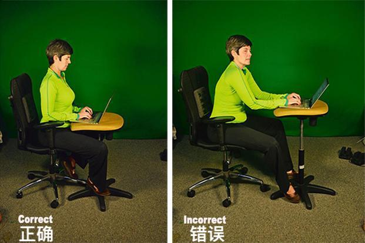
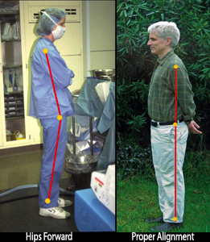

# “猫式”坐姿🐱

上班族学生党每天坐十小时也不累，养成正确工作学习习惯告别颈椎病✌️

## 硅谷的姿势大神

把自己的脊柱也调整成J形。

“你强行挺直腰杆，但不久，你就会累了，肌肉太紧张，于是你又回到弯腰驼背的状态。”

“强行挺直和弯腰驼背都不是好姿势，我们需要放松的挺直。”

“右边这人是坐在尾巴上，但左边这人是把尾巴甩在身后，对我们人类来说，**自然的方式应该是尾巴长在身后。人前倾，尾巴在后面。”**

****

**  
****坐的时候，要保证双腿往外，膝盖也要指向外面。**

### 站姿

首先，站的时候要把全身的重量落到脚后跟。

像下图右边这个大叔这样，

## 其他
多多运动也很重要！打羽毛球游泳对颈椎很好。

> 更新: 2019-07-30 09:50:01  
> 原文: <https://www.yuque.com/u3641/dxlfpu/guioad>