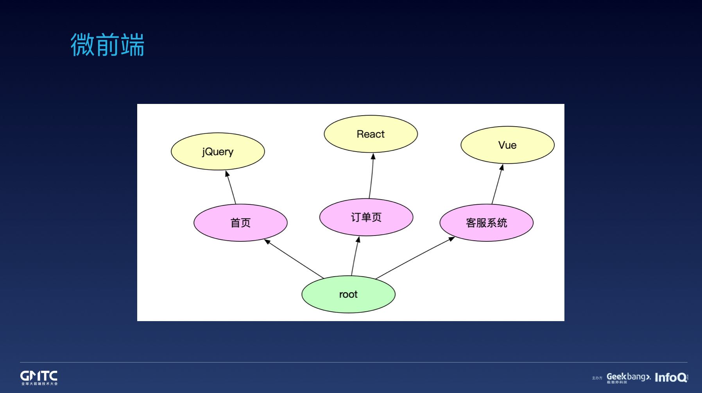
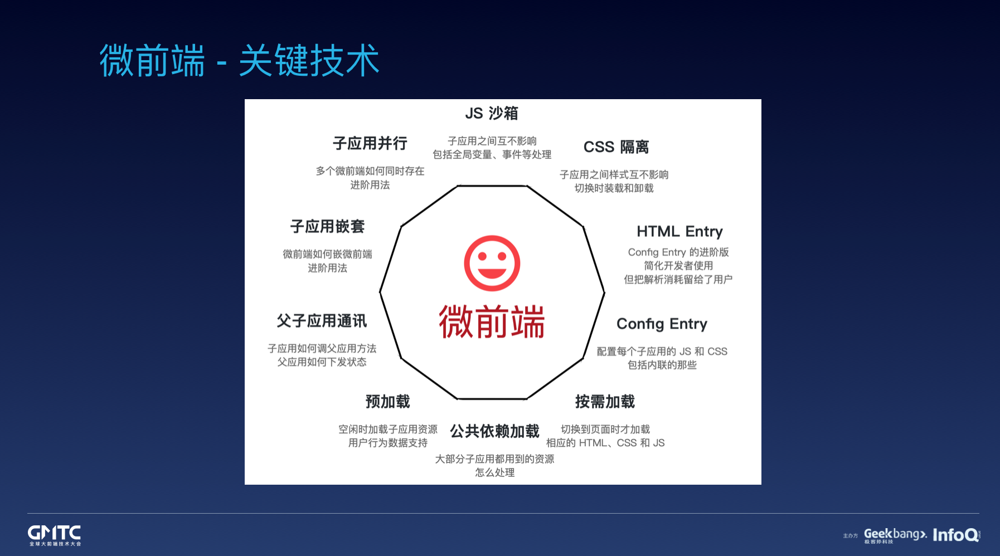
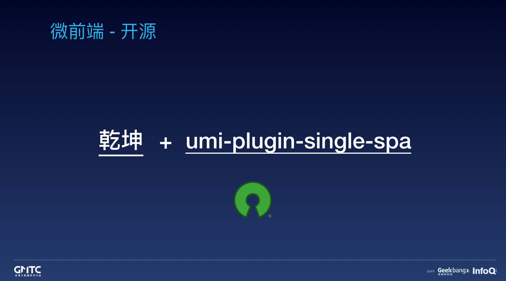

# 微前端

最近微前端很火

## 微服务
我们先来看看微服务 微后端是什么

微服务的改造

1. 首先服务之间远程调用，服务的注册和发现机制必须有好的**分布式服务框架**（类似dubbo）支持，方便做服务之间的调用配置管理。
2. 部署的服务进程增加以后，对应的日志文件也会增多，这时再使用ssh到服务器上查看日志，这个工作量也是可想而知的。我们对业务日志做了规范化约束，然后使用**ELK**技术栈搭建了日志集中化管理系统。
3. 为了能够对线上的所有服务有个全局的把控，我们根据注册中心的数据搭建了**服务的管理系统**，展示各个维度的统计数据，例如，每个主机上多少个应用，每个应用提供了多少个服务，同时又消费了多少个服务等等。还有一些针对服务的约束规则的告警信息，例如某个应用消费的服务，却没有服务提供者等。还有一个整体的应用之间的依赖关系图。
4. 为了优化系统结构和排查问题，搭建了**服务的监控系统**，这个是依赖分布式服务框架打印的预统计日志的，通过这些日志分析得到一个整体的服务监控功能，例如每个服务的响应时间、错误率等。还有调用链跟踪功能，排查问题时使用它来跟踪请求信息。
5. **服务治理**功能用来及时地对线上项目做一些调整，例如限流、降级、负载均衡、超时、路由、隔离容错等。

服务之前接口如何调用？

在进行微服务化改造的时候，接口的设计上遇到了一个问题，服务之间的调用是通过私有协议进行的RPC调用

## 解决什么问题

解决巨无霸项目的维护，这样拆分后，一个巨无霸项目，可能会成多个子应用，每个子应用可能会是不同的团队在维护。

## 狭义的理解

微前端狭义的理解就是一个工程使用多种框架，React + Vue + Jquery，解决多种框架共存的一个方案。

但是，如果我们使用一个框架，是不是不需要微前端了？

多个子系统开发？

> 比如淘宝网，可以简单理解成有淘宝首页、交易系统和帮助系统，这些系统是优先级的，并且在我们人力有限的情况下，我们会把资深的同学投入到重要的系统里，不重要的系统我们可能会通过外包或者购买的方式解决，但是一个底线是，不重要的系统不能影响重要的系统的运转。
>

要实现这一点，目前流行的有两种方式：

+ MPA（多页应用）
+ 微前端

MPA，成本低，好用。如果为了更好的体验，不妨试试微前端，微前端可以做成SPA。

**搭配UMI使用**

****

然后，搭配 umi 插件使用，效果会更好，比如我们建几个 umi 应用，配置一个为主应用，其他的为子应用，然后串起来就能跑了

## MPA方案

MPA 方案的优点在于 部署简单、各应用之间硬隔离，天生具备技术栈无关、独立开发、独立部署的特性。缺点则也很明显，应用之间切换会造成浏览器重刷，由于产品域名之间相互跳转，流程体验上会存在断点。

## SPA方案
### iframe
目前使用iframe来做子应用载体，天然解决样式和js污染，缺点就是每次都需要重新加载，而且需要服务端支持

> 综合这些因素，才有了将SP拆分、重构、升级的想法。这次SP改造经历了一个比较漫长的过程，最先是将SP对接统一登录服务，这样可以在
>
> 
>

> 新的系统中开发功能，多个系统通过SSO共享登录状态；在新的业务系统中使用React开发前端，并抽象出一些公共组件，其他系统可以套用
>

> 
>

> 这个模板来开发，相比以前很大程度上提高了开发效率；同时实现了一个简易的权限模块，前端对接后就能够实现权限的可配置化。
>

## 看一下phodal的微前端方案

嗯 已经出书了 京东：《前端架构：从入门到微前端》

Mooa 是一个为 Angular 服务的微前端框架。

[https://github.com/phodal/microfrontends](https://github.com/phodal/microfrontends)

## 好处 组织灵活性和一致性

微前端的支持者强调它能像微服务那样减少团队间的依赖，提升组织灵活度。微前端的其他好处有：

+ 独立部署不同的服务
+ 实现自治团队，具备独立迭代和创新的能力
+ 能够围绕业务部门或产品来打造团队

## 不足 工程复杂度高
微前端让前端环境变得更加复杂了。如今在整个应用中进行任何类型的测试都可能需要多个前端协作，更不用说将这些前端组装在一起所需要的各种工具了。

本质上来说，我们是在用整个系统的复杂度代价换取单个前端的简洁度。

### 下载多次公共代码

只要坚持使用一种框架，并利用像 single-spa.js（https://single-spa.js.org/）这样的协作框架，你就可以通过资源共享和只需下载一次的公共代码来避免大多数性能损失。

可以使用共享组件库来消除许多不一致的用户体验。

## 权衡

对于小型、高度协作的团队和相对简单的产品来说，微前端的优势相比代价来说就很不明显了；而对于大型、功能众多的产品和许多较独立的团队来说，微前端的好处就会更突出。

## 微前端的实现
integration approaches 整合方法

+ Server-side template composition 服务器端模板组合
+ Build-time integration 构建时集成
+ Run-time integration via iframes 通过 iframe 的运行时集成
+ Run-time integration via JavaScript 通过 JavaScript 实现运行时集成
+ Run-time integration via Web Components 通过 Web 组件进行运行时集成

## qiankun

父应用 Umi

子应用1 Umi

子应用2 Umi

## Umi接入single-spa

[https://alili.tech/archive/9xuojm75d2a/](https://alili.tech/archive/9xuojm75d2a/)

## 参考

[微前端的简介、好处以及不同实现方法的全面介绍，我推荐 Cam Jackson 的微前端文章](https://martinfowler.com/articles/micro-frontends.html)

https://single-spa.js.org/ 【Microfrontends made easy】

[微前端如何落地？](https://github.com/phodal/articles/issues/54)

[每日优鲜供应链前端团队微前端改造](https://juejin.im/post/5d7f702ce51d4561f777e258)

> 更新: 2019-09-18 17:35:34  
> 原文: <https://www.yuque.com/u3641/dxlfpu/lx9yzl>