# 蚂蚁金服的前端框架和工程化实践

> 2017 年开始尝试了新一代的企业级前端框架，Umi 和 Bigfish，前者是从无线业务中长出来的，后者是从中台业务中长出来的。
>

# 框架时间线

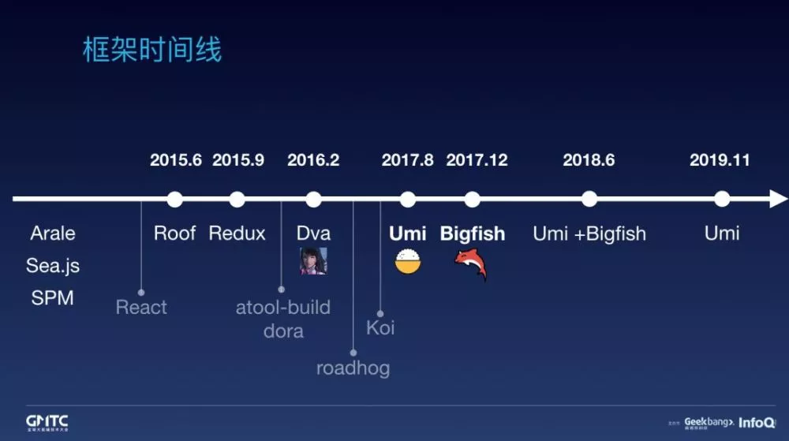

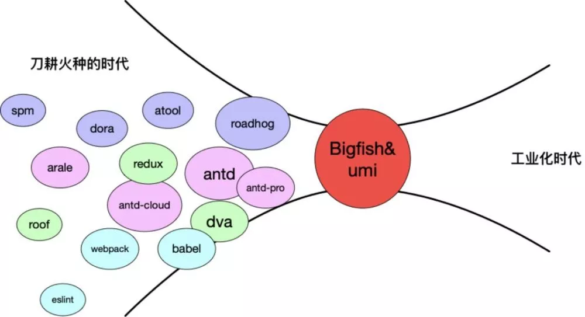

# 插件市场
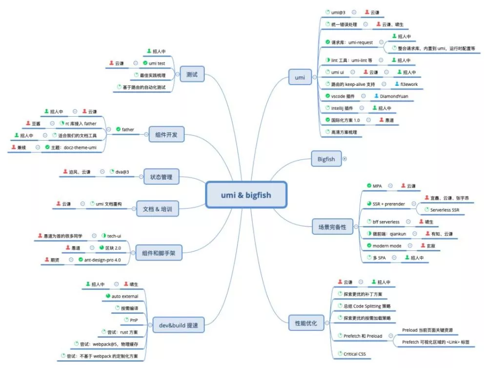

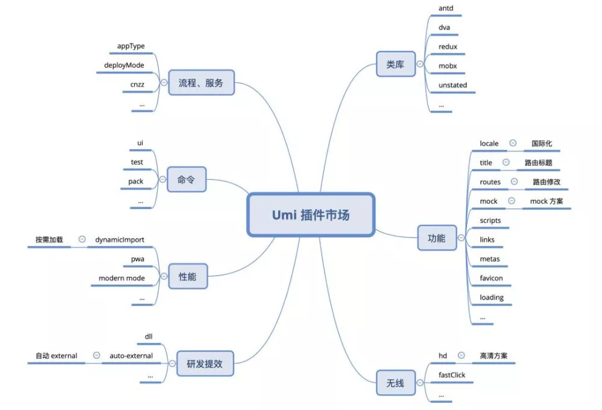

# 框架大图

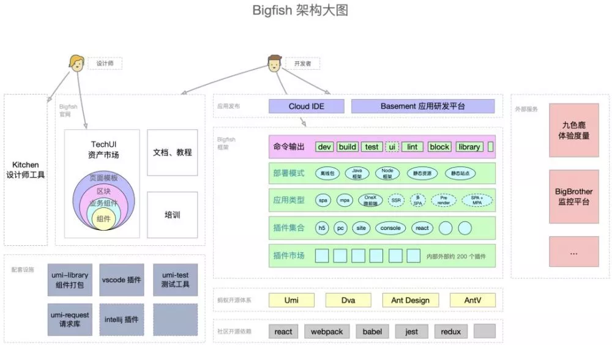

## 五层架构

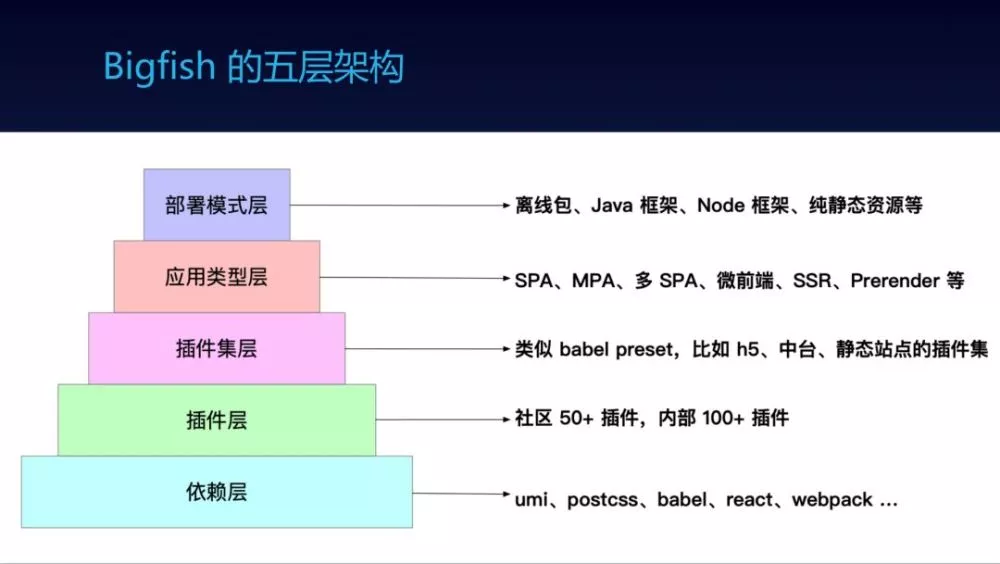

> 包含依赖层、插件层、插件集层、应用类型层和部署模式层，大家可在任何一层都可贡献代码，
>
> 
>
> 可以写一个独立的功能插件，比如和某个服务的对接，比如扩展路由的某个功能，比如实现一套特殊的补丁方案；
>
> 
>
> 可以做归类，把一系列插件整理到一个插件集里，适用于某一类的业务开发；
>
> 
>
> 可以扩展应用类型，比如 SPA、MPA、微前端等等；
>
> 
>
> 可以扩展部署模式，比如和不同的框架或平台做结合；
>

# 资产

> 今年由于大形势的原因，我们比较重研发提效，最好是一个人能干 10 个人的活。关于提效，其中比较重要的是相同的代码不要重复写，要做提取和组件化。而资产市场就是做的这件事
>

+ 组件，指通用组件，就是 antd，在下半年将要发布的 antd@4 里，我们会陆续提取更多通用组件到 antd 中。
+ 业务组件，不能提取通用组件的，我们会提到内部统一的业务组件仓库中。
+ 区块，由组件组成，可以想象成代码片段。
+ 页面模板，由区块组成

飞冰的资产分类

+ 组件
+ 区块
+ 项目模板

# 专题研究

## 路由
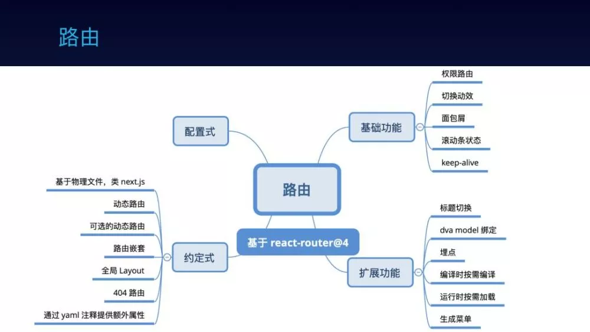

## 编译加速

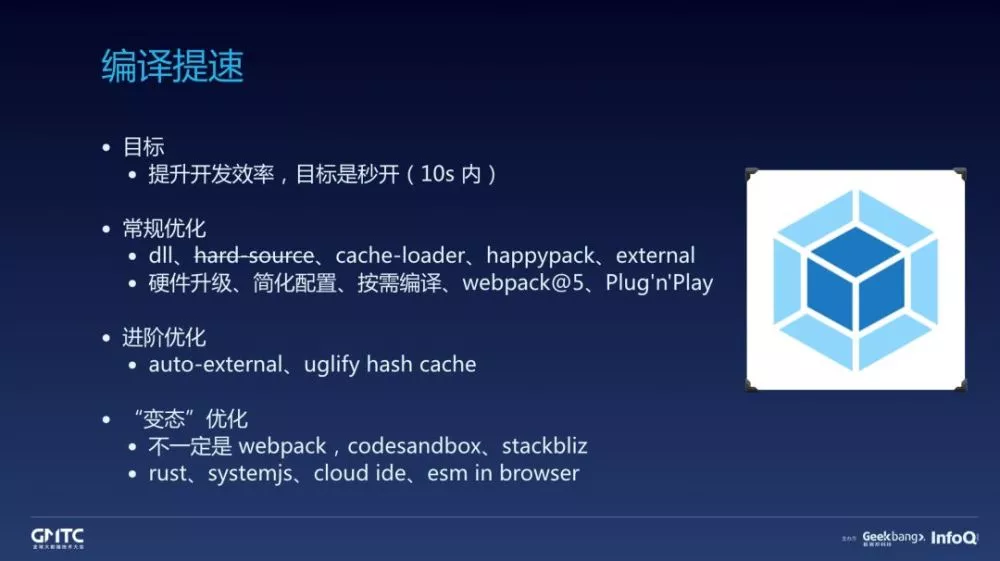

• dll，把不会修改到的部分打到 dll 里，避免重复打包。

• hard-source，利用物理文件缓存，但由于作者不维护，此方案已废弃。

• cache-loader、happypack。

• external，比 dll 更有效的提速方案。

• 硬件升级，简单粗暴有效，有个案例是我们其中一个项目的 ci 需要 12 分钟，换了台机器后，只要 5 分钟，所以有时做很多努力，不如换台机器。

• 简化配置，只给当前项目需要的配置，比如多一个模块 resolve 规则，或者多载入不需要的 loader，都会降低编译速度。

• webpack@5，有时做很多努力，不如升个大版本提升大，参考 node 升级带来的性能提升。以 ant-design-pro 为例试验了下 webpack@5 的物理缓存能力，首次编译需要 37s，二次编译只要 4s！

## 性能优化
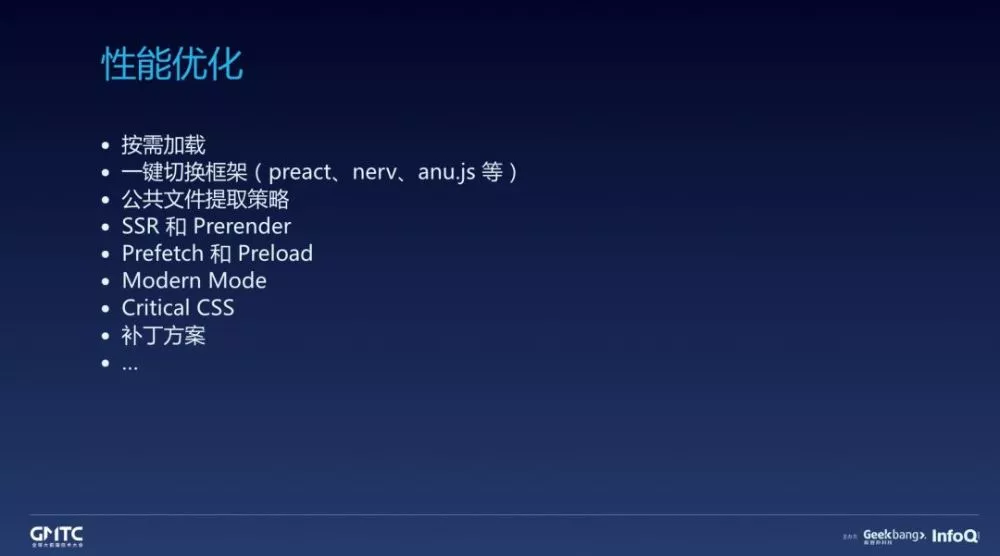

**modern mode，如果大家有听说过，对，就是 vue-cli 的那个 modern mode**

## 浏览器兼容
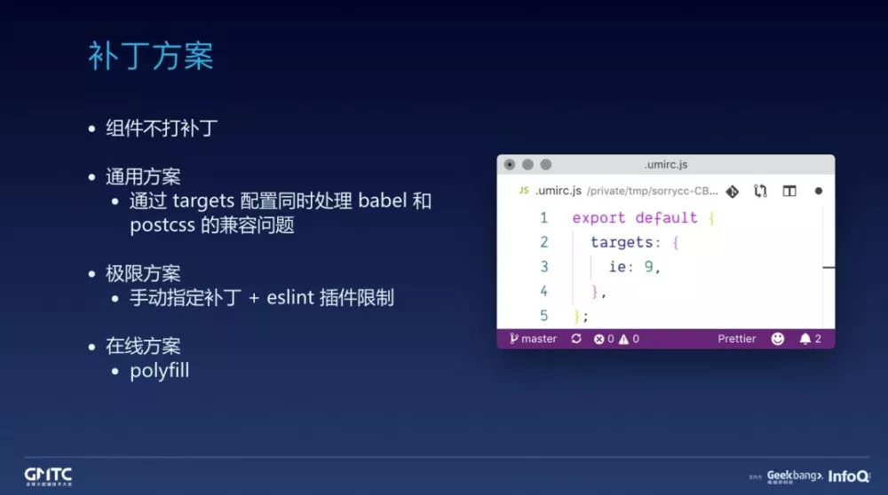

组件不打补丁，这点上很多人有认知误区，组件会做语法转换，但不会包含补丁，因为包含补丁会造成冗余。

某些场景会很在意性能，多一个字节都舍不得，比如无线H5，他们会追求 极限方案，强制写死就打某几个补丁，然后通过 eslint 插件限制不能使用需要补丁的那些 es 语法，用了就报错。

## 测试

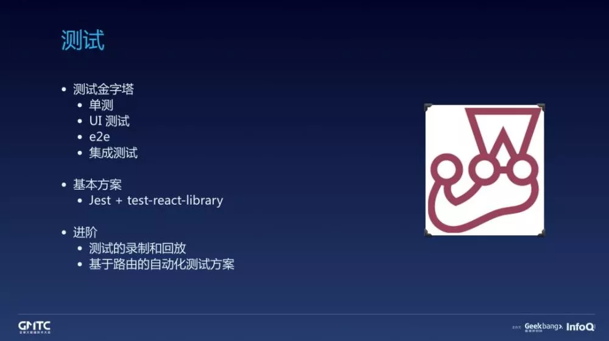

## 大一统

内外网的框架方案保持一致。

> Bigfish + Umi 的内外结合的方式目前看起来还不错，但毕竟是两个团队妥协后的方案，在我们需要服务外部 ISV 时暴露了一些问题：
>
> 
>

> Bigfish 是内网框架，绑了很多内部服务，不能直接给 ISV 用。
>
> umi 给 ISV 又会存在一些差异。
>
> 
>
> Umi 增加 Preset 的概念，之前的 Bigfish 框架提供 umi-preset-bigfish 服务内部同学。
>

> 
>

> 更新: 2020-07-13 10:08:36  
> 原文: <https://www.yuque.com/u3641/dxlfpu/tkozru>