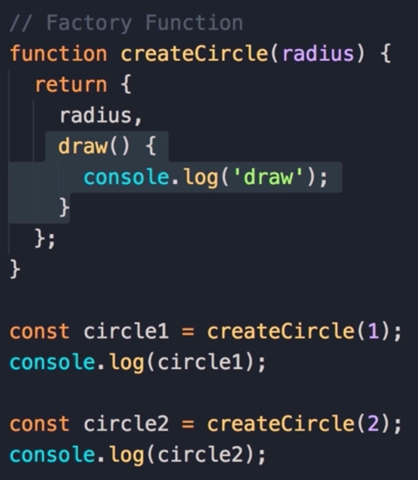
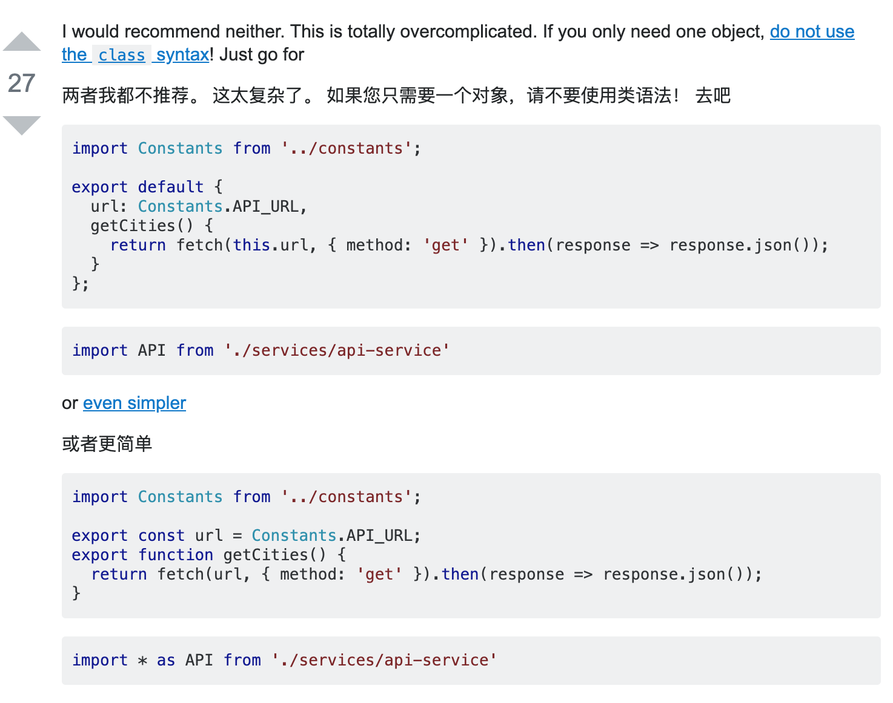

# 设计模式

## 分类


总体来说设计模式分为三大类：


创建型模式，共五种：工厂方法模式、抽象工厂模式、**单例模式**、建造者模式、原型模式。

结构型模式，共七种：适配器模式、装饰器模式、代理模式、外观模式、桥接模式、组合模式、享元模式。

行为型模式，共十一种：策略模式、模板方法模式、**观察者模式**、迭代子模式、责任链模式、命令模式、备忘录模式、状态模式、访问者模式、中介者模式、解释器模式。


## 工厂模式


常见的实例化对象模式


  



## 单例模式


保证一个类仅有一个实例，并提供一个访问它的全局访问点，一般登录、购物车等都是一个单例


### 实现1 提供一个方法生成实例


```javascript
    // 单例对象
    class SingleObject {
        login () {}
    }
    // 访问方法
    SingleObject.getInstance = (function () {
        let instance;
        return function () {
            if (!instance) {
                instance = new SingleObject();
            }
            return instance;
        }
    })()
    const obj1 = SingleObject.getInstance();
    const obj2 = SingleObject.getInstance();
    console.log(obj1 === obj2); // true

```


### ES6 Proxy实现单例模式


Proxy 对象用于定义基本操作的自定义行为（如属性查找，赋值，枚举，函数调用等）。


看一看这篇文章 使用class语法实现代理模式 [https://stackoverflow.com/questions/48366563/es6-singleton-vs-instantiating-a-class-once](https://stackoverflow.com/questions/48366563/es6-singleton-vs-instantiating-a-class-once)


```java
let textElement = document.getElementById('updateText');
let singletonInstance = null;

class SingletonExample {
  constructor() {
    // Check if the instance exists or is null
    if (!singletonInstance) {
      // If null, set singletonInstance to this Class 
      singletonInstance = this;
      textElement.textContent = "Singleton Class Created!";
    } else {
      textElement.innerHTML += "<br>Whoopsie, you're only allowed one instance of this Class!";
    }

    // Returns the initiated Class
    return singletonInstance;
  }
}

// Create a new instance of singleton Class
let singletonExample = new SingletonExample();
let singletonExample2 = new SingletonExample();
```


其实 你可以使用export 模块 语法导出单例 😁

  



### 运用Proxy和Reflect实现单例模式


见snippets single2例子


### When use 单例


> When should I use singleton?
>
> 
>
> Singletons should be used when
>
> You can only have a single instance
>
> You need to manage the state of this instance.
>
> You do not care about initialization of this instance at runtime.
>
> You need to access it across your app.
>
> 
>
> Beware, singletons are considered an anti-pattern and make unit-testing extremely difficult.
>


## 适配器模式


用来解决两个接口不兼容问题，由一个对象来包装不兼容的对象，比如参数转换，允许直接访问


应用场景：Vue的computed、旧的JSON格式转换成新的格式等


## 装饰器模式


在不改变对象自身的基础上，动态的给某个对象添加新的功能


应用场景：ES7装饰器


## 策略模式
## **代理模式**
ES6 proxy


## 外观模式
JS事件不同浏览器兼容处理、同一方法可以传入不同参数兼容处理


```javascript
// 跨浏览器事件侦听器
function addEvent(el, type, fn) {
    if (window.addEventListener) {
        el.addEventListener(type, fn, false);
    } else if (window.attachEvent) {
        el.attachEvent('on' + type, fn);
    } else {
        el['on' + type] = fn;
    }
}

```


## 观察者模式 发布-订阅


一对多 当一个对象的状态发生改变时，所有依赖于它的对象都将得到通知


Trigger 发布

订阅 


> 更新: 2020-07-05 16:50:09  
> 原文: <https://www.yuque.com/u3641/dxlfpu/pgrvc2>