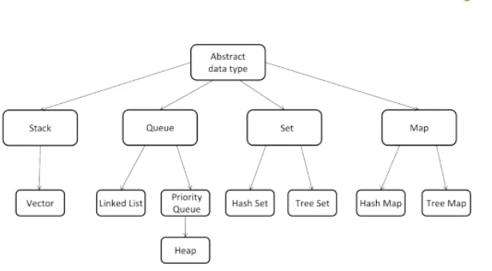
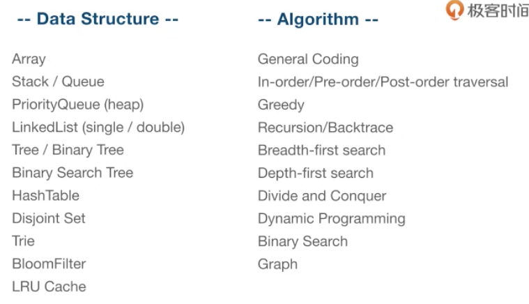

# 数据结构

## HOW
+ 为何要选择不同的数据结构？
+ 选择不同的数据结构能为我们带来什么？
+ 节省的是时间复杂度还是空间复杂度？

## 学习方法
+ 庖丁解牛
+ 刻意练习
+ 和已有知识建立联系
+ 得到及时反馈
+ 与自己斗争

## 结构图

## 
## 栈

## 队列
+ 对数组和链表的改进
+ 

### 优先队列
+ 对队列的改进
+ 

## 链表

## 树

## Trie 树 [字典树]

## 堆

### 堆内存中的指针
引用类型Object Array Function Date 存放的是堆内存中的指针

## HashMap
ES6中Map就是一种哈希表结构

getElementById 就是通过HashMap 实现元素查找，查找唯一元素的时间复杂度是O(1)

> 更新: 2020-06-18 10:49:52  
> 原文: <https://www.yuque.com/u3641/dxlfpu/che2g9>