# 算法思维导图

## 参考

[https://github.com/trekhleb/javascript-algorithms/blob/master/README.zh-CN.md](https://github.com/trekhleb/javascript-algorithms/blob/master/README.zh-CN.md)

## 数据机构

## 算法
**算法是如何解决一类问题的明确规范。算法是一组精确定义操作序列的规则。**

## 算法范式
**算法范式是一种通用方法，基于一类算法的设计。这是比算法更高的抽象，就像算法是比计算机程序更高的抽象。**

> 更新: 2019-12-19 16:44:48  
> 原文: <https://www.yuque.com/u3641/dxlfpu/qipo40>