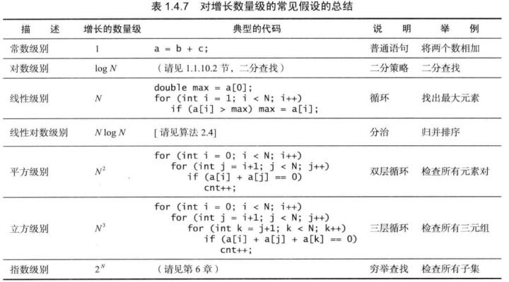
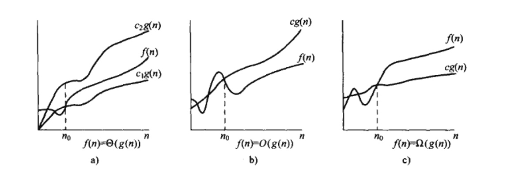
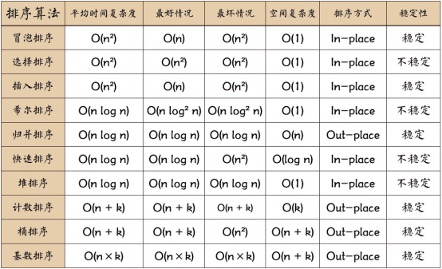

# 算法基础

## 算法动画了解
[https://visualgo.net/zh/list](https://visualgo.net/zh/list)

## 
## 时间复杂度
> 算法时间复杂度是衡量一个算法优劣的主要因素。
>

运行时间的增长率

再例如冒泡排序的时间复杂度是N*N；快排的时间复杂度是log(n)。

其实目的只有一个就是把衡量算法时间的关于输入规模的函数f(n)用另一个关于输入规模的函数集来表示

比如：  
要找到一个数组里面最大的一个数，你要把n个变量都扫描一遍，操作次数为n，那么算法复杂度是O(n).

用冒泡排序排一个数组，对于n个变量的数组，需要交换变量位置次，那么算法复杂度就是O(n^2).

有时候，如果对变量操作的次数是个多项式比如, 就取数量级最大的那个，O()

> Big O. [https://zh.wikipedia.org/wiki/大O符号](https://zh.wikipedia.org/wiki/%E5%A4%A7O%E7%AC%A6%E5%8F%B7)
>

> 《算法导论》
>

### Big 0
大O符号（英语：Big O notation），又称为渐进符号，是用于描述函数渐近行为的数学符号。更确切地说，它是用另一个（通常更简单的）函数来描述一个函数数量级的渐近上界。在数学中，它一般用来刻画被截断的无穷级数尤其是渐近级数的剩余项；在计算机科学中，它在分析算法复杂性的方面非常有用。

渐近上界: 最坏的情况

所以当我们说“时间复杂度为O(n²)时”，也就是说最坏情况下时间复杂度为O(n²)。

有一些常见的增长快慢的函数：

指数量级： 2n,3n,n!

多项式量级： n,n2,nlogn,x{1⁄2}

对数多项式量级： logn,log^2 n,loglogn

> 算法的好坏，叫做效率。
>

O(n)是线性的，比如我有一个数据结构是队列，里面有n个元素，我从头到尾遍历一遍，复杂度就是O(n).O(  )是二次方的，比如冒泡算法就是典型的，需要在一个线性数据结构上进行二重循环的操作。通常我们对算法的追求O(logN)或者O(1)，但这两种时间复杂度是可遇不可求的。

O(logN)一般的要求是二分法，应用在顺序的数据结构上。至于O(1)，如果输入的量级和输出完全无关，那么他就是常数级别的时间复杂度，这是理论上最好的时间复杂度。

### 渐进记号
渐进确界 渐进上界（最坏情况） 渐进下界（最好情况）

### 通俗解释

有100个人站在你面前，脸盲的你得两两结对、一对一对观察，才能找到唯一的一对双胞胎。同上，我总是可以把双胞胎放在你最后找到的一对。你至多一共要观察4 950对。如果换成10 000个，那就是49 995 000对，也就是10 100倍的工作量这就是O(n²)

有128个人站在你面前，你要把他们按照高矮排序——我们假设用归并排序——你先把他们分成两个64人的大队，每个大队分成两个32人的中队，每个中队分成……直到最后每一个“小小…小队”只剩一个人。显然，一个人一定是已经排好序的。然后反向操作，将刚刚拆分的队伍合并起来。合并队伍的时候，由于已经排好序，只需要取出两队排头进行比较，就找到了最矮的一个，取出来——如此进行下去，合成的两倍大的队伍也将是有序的。显然，这个合并操作，是O(n)的。总共的比较次数，不会超过两个队伍的总人数。最后的问题只是，有多少次“分割-合并”操作。每次分割数量都减半，很明显是7（log 128）次。由此看来，大致需要执行7×128次操作。这就是O(nlogn)。

## 排序算法

### 排序在前端的实现
Array.prototype.sort

目前大部分浏览器通过使用归并排序和快排来实现sort方法

### 快排
+ 先从数列中去除一个数作为“基准”（理论上可以随便选取一个数）
+ 实现数组分区：将比这个”基准数“大的数放到“基准”的右边，小于或等于“基准数”的数放到“基准”的左边；
+ 再对左右区间重复第二步，直到各区间只有一个数

## 反转单向链表

## 树的遍历

## 字符串相关

字符串相关算法中，Trie 树可以解决解决很多问题，同时具备良好的空间和时间复杂度，比如以下问题

词频统计

前缀匹配

## 动态规划

> 更新: 2019-01-22 13:55:43  
> 原文: <https://www.yuque.com/u3641/dxlfpu/zwgmpm>